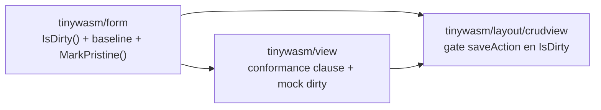

# CRUD — Guardado solo si hay cambios (dirty-check) — Plan Maestro

> Documento para **revisión** antes de implementar. Multi-repo (`tinywasm/form`,
> `tinywasm/view`, `tinywasm/layout`), por eso vive aquí y no en un solo
> `docs/PLAN.md`. Sigue `CONSTRUCTION_HARNESS.md`: la corrección vive en el tipo
> y en el contrato (conformance), no en un manual ni en glue por módulo.

## 1. El fallo observado

En un CRUD, al editar un registro y **cambiar el foco sin modificar nada**, el
auto-save on blur igual persiste (se ve el toast "Guardado"). Debe guardar
**solo si los datos difieren** del registro cargado. No es un detalle del demo:
es un comportamiento esperado de cualquier app con formularios, y hoy no existe
en ninguna capa — cada módulo CRUD que se agregue lo heredaría roto.

## 2. Lo que encontró la investigación (el seam real)

- **`layout/crudview`** conecta el auto-save así (`crudview/crud.go:44`):
  `f.OnFieldChange(func() { v.autoSaveAction() })`. Y `autoSaveAction`
  (`crudview/crudview.go:298-305`) llama a `saveAction` **sin ninguna
  condición** — cada blur/commit persiste.
- **`tinywasm/form`** guarda el valor actual de cada input en
  `valueSignals []*dom.SignalString` (única fuente de verdad: la escriben tanto
  `LoadValues`, `form/load.go:31`, como `SetValues`, `form/form.go:327`, y
  `reset`, `form/form.go:305`). Pero **no guarda ninguna línea base** del estado
  cargado, así que el form **no puede saber si el usuario cambió algo**. Ese es
  el hueco.
- **`view/conformance`** ya define el contrato CRUD como un `Driver` + cláusulas
  (`conformance/conformance.go`): existe `save_ships_form_values` (editar +
  guardar envía los valores), pero **falta la cláusula inversa** ("sin cambios,
  guardar no envía nada"). El `Driver.Save` de crudview mapea a `saveAction`
  (`layout/crudview/conformance_test.go`), y el renderer de referencia
  (`view/mock`) simula guardar sin noción de "dirty".

## 3. El principio: dónde vive cada cosa (la justificación)

La pregunta de arquitectura es **dónde** poner "¿cambió?". Tres caminos:

- **A — En cada módulo CRUD (glue).** Cada módulo compararía antes/después en su
  `OnSaved`/wiring. ❌ Es exactamente la duplicación que se quiere evitar: N
  módulos, N copias del mismo check, N formas de equivocarse.
- **B — Solo en `crudview`.** crudview toma un snapshot del `Record()` al
  cargar y, en cada auto-save, hace `SyncValues` a un record temporal y lo
  compara campo a campo. ✅ No se duplica entre módulos (todos usan crudview).
  ❌ Pero crudview **reinventa** un "cambió" que pertenece al formulario, y el
  resultado no lo puede reusar ningún otro renderer; además mete lógica de
  diffing de records en la capa de orquestación, que no es su responsabilidad.
- **C — Primitiva en `tinywasm/form` + gate en `crudview` + contrato en
  `conformance`. ✅✅ (RECOMENDADA).**
  - `form.IsDirty() bool`: el formulario es el **dueño natural** de los valores;
    ya tiene el actual (`valueSignals`), solo le falta la **línea base** (un
    snapshot al cargar). `IsDirty` compara actual vs base. Es una primitiva
    reusable por **cualquier** renderer, no solo crudview.
  - `crudview` **gatea** el guardado con esa primitiva (una línea). Como
    crudview es el **único renderer compartido** por todos los módulos CRUD, el
    gate se escribe **una vez** y todo módulo nuevo lo hereda sin copiar nada.
  - `view/conformance` añade la **cláusula** "sin cambios no persiste": convierte
    el comportamiento en un **contrato cross-renderer** verificado por test, no
    en una convención que hay que recordar.

### Por qué C es la que respeta el CONSTRUCTION_HARNESS

- **Corrección en la capa correcta.** El harness manda arreglar el hueco de API
  *upstream*, no parchear en la hoja. "¿Cambió el formulario?" es del
  formulario; ponerlo ahí es la reparación correcta, no un workaround en el
  consumidor.
- **Superficie mínima y tipada.** Un método `IsDirty() bool` (auto-descriptivo,
  sin `any`, sin genéricos); la línea base es estado **interno** no exportado.
  Una sola forma de preguntarlo.
- **La corrección se mueve al compilador/al test.** Con la cláusula de
  conformance, cualquier renderer que afirme implementar CRUD **debe** pasar
  "sin cambios → no guarda". Un agente sin contexto que agregue el módulo N no
  puede reintroducir el bug: el harness de conformance lo rechaza.
- **Escalable por construcción.** Módulo nuevo → usa `view.New(...)` +
  `crudview.New(...)` → hereda el gate. Renderer nuevo → usa `form.IsDirty()` o
  implementa el contrato. Cero duplicación en ambos ejes.

## 4. El contrato (conformance) — el corazón del cambio

Cláusulas nuevas en `view/conformance` (verificadas contra `view/mock` **y**
contra `layout/crudview`):

- **`unchanged_save_does_not_ship`** (nueva): `Mount()` → `Select(id)` (carga un
  registro existente en el form) → `Save()` **sin** `SetField` → se espera
  **cero** llamadas al op de guardado.
- **`revert_edit_is_not_dirty`** (nueva, opcional pero recomendada): `Select(id)`
  → `SetField(name, "otro")` → `SetField(name, valorOriginal)` → `Save()` → cero
  llamadas: volver al valor cargado limpia el estado.
- **`changed_save_ships`**: ya cubierto en esencia por `save_ships_form_values`
  (editar + guardar sí envía); se mantiene y sirve de contraparte positiva.

El `view/mock.Renderer` debe modelar la línea base: snapshot de campos en
`Select`/carga, comparación en `Save`. Es la implementación de referencia del
contrato (igual que crudview lo implementa vía `form.IsDirty`).

## 5. Cambios por librería y orden (gates)

### 5.1 `tinywasm/form` (primero — es dependencia de todos)
- Campo interno `baseline []string` (un valor por input).
- Capturar la base cuando el form llega a un estado "cargado y limpio":
  al construir (`New`), en `LoadValues`, y en `reset`.
- `func (f *Form) IsDirty() bool`: `true` si algún `valueSignals[i].Get()` difiere
  de `baseline[i]`.
- `func (f *Form) MarkPristine()`: re-snapshotea la base = actual. Lo llama el
  host tras un guardado exitoso, para que un segundo blur sin cambios no vuelva a
  persistir. (Alternativa a evaluar en revisión: re-snapshot dentro de
  `SyncValues`; se prefiere método explícito por claridad y una sola forma.)
- Test con forma de consumidor en el propio repo (obligatorio por el harness):
  cargar → `IsDirty()==false`; editar → `true`; revertir → `false`;
  `MarkPristine` → `false`.

### 5.2 `tinywasm/view` (después de form)
- `conformance/conformance.go`: agregar `unchanged_save_does_not_ship` (y
  `revert_edit_is_not_dirty`) al `Run(...)`.
- `mock/renderer.go`: trackear dirty (snapshot en `Select`/load, comparar en
  `Save`) para satisfacer el contrato.
- Ajustar `view/tests` si enumeran cláusulas.

### 5.3 `tinywasm/layout` (último — depende de form y view)
- `crudview/crudview.go`: en el camino de guardado, `if v.form == nil ||
  !v.form.IsDirty() { return }` **antes** de persistir; tras un `saver.Save`
  exitoso, `v.form.MarkPristine()`.
  - Decisión a revisar: gatear en `saveAction` (todo guardado; el `Driver.Save`
    ya mapea ahí, así el contrato prueba el camino real) vs solo en
    `autoSaveAction`. Recomiendo **`saveAction`**: un guardado sin cambios nunca
    aporta, venga de blur o de un futuro botón.
- `crudview/*_test.go`: el `TestViewConformance` hereda las cláusulas nuevas sin
  cambios de wiring (ya expone `Select`/`SetField`/`Save`). Verificar verde.

## 6. Grafo de dependencias

Publicación (orden obligado por el harness, no dejar consumidores apuntando a
versiones inexistentes): `form` → `view` → `layout`. Durante desarrollo local se
usan los `replace` ya vigentes; los tres se verifican juntos antes de publicar.

## 7. Decisiones que requieren tu revisión (antes de generar los PLAN por repo)

1. **Capa del gate**: `saveAction` (recomendado) vs `autoSaveAction`.
2. **Reset de la base tras guardar**: `MarkPristine()` explícito (recomendado)
   vs re-snapshot implícito en `SyncValues`.
3. **Nombre de la primitiva**: `IsDirty()` (recomendado, término estándar) vs
   `Changed()`/`HasChanges()`.
4. **Alcance de cláusulas**: incluir `revert_edit_is_not_dirty` además de la
   básica (recomendado) o solo la básica.

## 8. Protocolo de verificación (global)

- `gotest` verde en `form`, `view` y `layout` (vet/race/tests/wasm/coverage);
  `gofmt -l` limpio; builds nativo y `GOOS=js GOARCH=wasm` limpios.
- Las cláusulas nuevas de conformance pasan en `view/mock` **y** en
  `layout/crudview` (misma prueba, dos renderers — la prueba de que el contrato,
  no la implementación, es la fuente de verdad).
- MCP en vivo (`/#crud`, desktop + mobile, light + dark): seleccionar un registro
  y cambiar el foco **sin** editar → **ningún** toast "Guardado"; editar un campo
  y salir → un único "Guardado"; volver a salir sin más cambios → nada.

## 9. Entregables tras aprobación

Al aprobar esta arquitectura, se generan los `docs/PLAN.md` por repo en formato
CodeJob (frontmatter `PLAN:`, blockquote estándar, stages autocontenidos, tabla
de stages), uno por librería afectada (`form`, `view`, `layout`), cada uno
referenciando este master. No se implementa código antes de esa aprobación.
