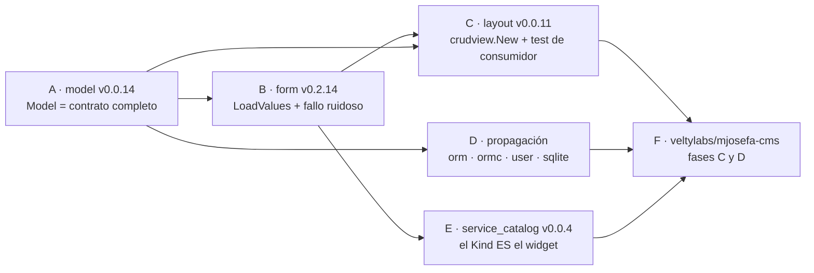

# CRUD Harness — Master Plan

> Orquestador. Cada librería afectada tiene su `docs/PLAN.md` autocontenido.
> Doctrina de dispatch: la app **siempre al final** (integra a las demás en una sola pasada).

## Por qué existe esta ola

`ormc` genera **siempre** las mismas capacidades juntas para todo modelo
(`ModelName`, `Schema`, `Pointers`, `IsNil`, `EncodeFields`, `DecodeFields`, `Validate`
— ver `ormc/generate.go:180` y `:261`, emitidos sin condición). Pero `tinywasm/model`
las publica como **átomos sueltos** (`Fielder`, `ModuleNaming`, `Encodable`, `Decodable`,
`Validator`) y solo nombra dos combinaciones arbitrarias (`Model` = Fielder+ModuleNaming,
`SafeFields` = Fielder+Validator).

Consecuencia: **toda frontera que cruza dos consumidores se queda sin tipo que nombrar.**
Un layout CRUD necesita `Fielder` (para generar el form), `Encodable` (para mandar el
registro por el cable vía `router.Caller`) y `Decodable` (para recibirlo). No existe ese
tipo, así que el consumidor se inventa la intersección en su propio repo:

```go
// lo que un agente escribió en veltylabs/mjosefa-cms — deuda por construcción
type Model interface { model.Fielder; model.Encodable }
```

Eso (a) **sombrea `model.Model`** con un contrato distinto, (b) está incompleto (le falta
`Decodable`), y (c) vive en un repo hoja, así que **no se puede reutilizar jamás**: la
siguiente app lo re-inventa.

Es la **tercera vez** con la misma forma (antes: el wrapper `mcpPublic` sobre `mcp.Server`,
y el wrapper `AuthModule` sobre `userserver.Module` — ambos revertidos). El patrón: el hueco
de API se descubre **en la hoja**, donde el agente no tiene autoridad para publicar aguas
arriba, así que parchea localmente. **La deuda no es accidental: el flujo la garantiza.**

Además hoy `CrudCfg{Model: <un Fielder que no serializa>}` **compila** y muere en runtime.
Eso viola de frente el arnés de construcción
(https://github.com/tinywasm/app/blob/main/docs/CONSTRUCTION_HARNESS.md):
*"typed over any"* e *"illegal states unrepresentable"*.

## Los cuatro huecos reales (medidos contra el fuente publicado)

| # | Hueco | Dónde | Evidencia |
|---|---|---|---|
| 1 | No existe el tipo "registro de dominio completo" | `model` | `Model` = solo Fielder+ModuleNaming (`model/interface.go:43`) |
| 2 | No existe el inverso de `SyncValues` (struct → form) | `form` | solo `SyncValues` (form → struct) y `SetValues(field, string)` campo a campo |
| 3 | El pegamento form↔lista↔caller no existe: cada app lo reescribe | `layout/crudview` | `CrudView.Form` es un `Component` opaco; nadie cablea form+modelo+caller |
| 4 | **Un modelo sin widgets produce un formulario vacío, en silencio** | `form` + dominios | `form.New` hace `field.Type.(input.Input)` y `continue` si falla; `service_catalog` declara todo con `model.Text()` → **cero inputs, `err == nil`** |

El hueco 2 es el más caro: sin él, "seleccionar una card → rellenar el form" obliga al
consumidor a convertir **campo por campo a string a mano**, que es exactamente el
boilerplate sin reflexión que el ecosistema existe para eliminar.

El hueco 4 es el más peligroso: el doc-comment de `form.New` dice *"Returns an error if any
exported field has no matching registered input"*, pero **el código hace `continue`**. Doc y
código llevan divergiendo desde siempre, y el resultado es un panel izquierdo en blanco sin
un solo error. Viola *"never a silent failure"* del arnés. La clave del arreglo: `input.Input`
**embebe `model.Kind`** — o sea **el Kind ES el widget**. Un dominio declara
`Type: input.Text()` en vez de `model.Text()` y el mismo valor sirve para la BD y para el form.

## La regla que detiene la reincidencia

> **Una API no está publicada hasta que un test con forma de consumidor, dentro de la
> propia librería, la demuestra.**

`crudview` tiene tests, pero prueban `crudview` **aislado**, con `Form Component` como slot
opaco: nunca cruzan `form` + un modelo `ormc` + un `router.Caller`. Ese es el agujero por el
que se escapó todo esto. La fase C lo cierra con un test que construye la vista CRUD
completa exactamente como la escribirá una app.

## Grafo de dependencias



| Fase | Repo | Plan | Tipo | Gate | Estado |
|---|---|---|---|---|---|
| A | `tinywasm/model` | `docs/LAST_PLAN_EXECUTED.md` | **gate** — bloquea todo | — | ✅ **publicado v0.0.14** 2026-07-14, LOCAL. Cascade de `gopush` NO propagó a `sqlite`/`orm`/`app`/`postgres`/`sqlt`/`sqlmcp`/`user`/`indexdb` (vet preexistente, no causado por este cambio; repos intactos en v0.0.12) — fase D los toma deliberadamente |
| B | `tinywasm/form` | `docs/PLAN_EXECUTED.md` | paralelo con D | A publicada | ✅ **publicado v0.2.14** 2026-07-14 vía codejob (Jules, PR #16). `user` reportó `tests ❌` transitorio al bumpear — reproducido a mano, verde; republicado como `user` v0.0.36 |
| C | `tinywasm/layout` | `docs/PLAN.md` | **gate** de la app | A + B publicadas | ☐ |
| D | `orm`, `ormc`, `user`, `sqlite` | sin plan (recompilado) | paralelo con B | A publicada | ✅ **cerrada** 2026-07-14, LOCAL — `ormc` v0.0.14 (auto, cascade), `orm` v0.9.28 (fix: `emptyModel`/`MockModel` sin `Encodable`/`Decodable`), `sqlite` v0.2.6 (fix: 7 fixtures de test a mano sin `Encodable`/`Decodable`), `user` v0.0.35 (sin defecto propio, solo esperaba a `sqlite`) |
| E | `veltylabs/modules/service_catalog` | `docs/PLAN.md` | paralelo con C | A + B publicadas | ☐ |
| F | `veltylabs/mjosefa-cms` | `docs/PLAN.md` | **último, siempre** | C + D + E publicadas | ☐ |

## Fase D — por qué es un recompilado y no una reescritura

`model.Model` tiene ~140 usos en el ecosistema y **todos están dentro de código generado por
`ormc`** (el patrón `ReadAll(func() model.Model {...}, func(m model.Model) {...})` de
`orm/qb.go:158`) o en tests sobre structs generados. Todo valor que pasa por ahí **ya**
implementa `Encodable`+`Decodable`, porque `ormc` los emite sin condición.

El único riesgo real es un **implementador escrito a mano** de `model.Model`, cosa que el
propio doc de `model` prohíbe ("Implementations are generated by code generators — never
written by hand"). La fase A lo convierte en imposible añadiendo la aserción de compilación
`var _ model.Model = (*X)(nil)` a la salida de `ormc`, y la fase D lo **verifica con grep**
en cada repo antes de dar por buena la propagación. No se asume: se comprueba.

Procedimiento de D en cada repo: `go get -u github.com/tinywasm/model@v0.0.14 && gotest ./...`.
Si algo no compila, es un implementador a mano → **detenerse y reportarlo**, no adaptarlo.

## Criterio de cierre de la ola

1. `grep -rn "interface {" veltylabs/mjosefa-cms/config veltylabs/mjosefa-cms/modules` no
   declara ninguna interfaz que combine tipos de `model` — la app no re-nombra contratos.
2. La vista CRUD de un módulo se escribe **eligiendo un layout y pasando su modelo y sus
   ops**; el pegamento (form ↔ lista ↔ transporte) no aparece en la app.
3. Existe en `layout/crudview` un test que construye la vista completa a través de `form` +
   modelo `ormc` + `router.Caller` falso — el test que habría cazado los tres huecos.
