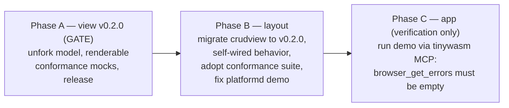

# CRUD View Conformance — Master Plan

> Orchestrator. Each affected library has its own self-contained `docs/PLAN.md`.
> Dispatch doctrine: consumers wait for their providers; the app is always last.
> Alignment source: [CONSTRUCTION_HARNESS.md](https://github.com/tinywasm/app-releases/blob/main/docs/CONSTRUCTION_HARNESS.md).
> This wave is the follow-up to `app-releases/docs/CRUD_HARNESS_MASTER_PLAN.md`
> (which fixed `form.New`'s silent empty-form hole — that loud error is what
> surfaced everything below).

**Status: DRAFT — for human review. Nothing is dispatched yet.**

## 1. The observed failure

`tinywasm -tui` from `layout/platformd`, browser console (captured via the
tinywasm MCP, `browser_get_errors` / `browser_get_console` on :6060):

```
panic: form.New: form has no renderable field — every Field.Type is a plain
model.Kind, not a form input.Input. Declare the widget in the model Definition
(input.Text(), input.Number(), …) instead of model.Text()/model.Int()
  main.mod.View            layout/platformd/web/client.go:70
  platformd.(*Platform).Render  layout/platformd/platformd.go:238
  dom.(*domWasm).Append / main.main
exit code: 2  →  "Go program has already exited"
```

**Root cause:** the demo's `mockModel.Schema()` declares
`{Name: "id", Type: model.Text()}` — a plain data Kind, no form widget.
`crudview.New` → `form.New(record)` fails loudly (by design, since form
v0.2.x), and `client.go:70` panics on that error. The error message is the
correct, intended diagnostic; the demo is the code that is wrong.

## 2. What the investigation actually found (5 findings)

The panic is only the surface. Reviewing `view`, `layout`, `form`, `model` and
`components` against the construction harness:

| # | Finding | Where | Harness rule violated |
|---|---------|-------|----------------------|
| 1 | Demo model declares `model.Text()` instead of `input.Text()` — panics at startup | `layout/platformd/web/client.go` | (consequence of #4/#5, not a lib defect) |
| 2 | **Live fork of `model`**: `replace github.com/tinywasm/model => ./model_fork` in `view/go.mod`, with a full copy of the library in `view/model_fork/`. Executing the fix revealed the fork wasn't just stale duplication: it carried `model.ModelSlice` (`FielderSlice`+`Decodable`), a type `view`'s public API depends on that had never been published upstream — a genuine missing contract, not a copy. Fixed by adding `ModelSlice` to `tinywasm/model` itself (now published as `v0.1.0`) and deleting the fork | `view` | *"Lego pieces, never forks"*, *"a missing contract at a boundary is a defect in the library, not in the consumer"* |
| 3 | **Unreleased breaking API**: `view` main (post-`v0.1.1`, PR #3) replaced `Presenter.CanSave/Save/CanDelete/Delete` with `Saver`/`Deleter` capability assertions + `Filter`/`Deselect`. No tag exists; `layout` pins `v0.1.0` (old API). The two worlds have already diverged: local `crudview` source calls `CanSave()` and only compiles against the cached v0.1.0 | `view` ↔ `layout` | release discipline — consumers can't migrate to an unpublished contract |
| 4 | **The conformance suite is unpassable by the renderer it certifies**: `view/conformance.MockRecord.Schema()` uses `model.Text()` (no widgets), so any form-based renderer (`crudview`) dies in `form.New` before the first clause runs. Today the suite only runs against the headless `view/mock` reference renderer | `view/conformance` | *"An API is not published until a consumer-shaped test … proves it"* — with **the real form package** |
| 5 | **Silent-override hole in `crudview`**: `New()` wires form-fill/save/delete into PUBLIC callback fields; assigning `cv.OnSelect = myToast` (exactly what the demo does) silently destroys the list→form fill. Compiles fine, breaks at runtime with no diagnostic | `layout/crudview` | *"Illegal states unrepresentable"*, *"never a silent failure"* |
| — | Minor: `crudview.filter()` re-implements term matching that `Presenter.Filter(term)` now owns; demo's `mockCaller` implements a `router.Caller` signature that no longer exists (dead code) | `layout` | *"The glue is written once, in the library that owns it"* |

**No changes needed in `form` or `model`.** The loud `form.New` error is the
harness working as intended — it caught every downstream defect above.

### 2b. On the `model.*` / `input.*` duality (reviewed, decision: keep)

Question raised in review: *"is the real problem that there are two ways to
declare widgets?"* Answer: there is only ONE way to declare a widget
(`input.*`); `input.Input` **embeds** `model.Kind`, so one value serves DB,
wire and form. The two vocabularies encode two intents:

- `model.Text()` — data-only Kind. Used by infrastructure that never renders
  (`sqlite`, `postgres`, `orm`, `storage`, `sse`, `devtui`, `devbrowser`).
- `input.Text()` — data + render. Used by domain modules that reach a form
  (`user`, `goflare-demo/contact`, veltylabs modules).

They live in separate packages because of dependency direction: `model` is the
base lego for the whole backend and must not carry UI metadata; `form/input`
depends on `model`, never the reverse.

The REAL hole is that for scalar kinds the vocabularies overlap and the
declaration site does not express the model's destiny: a form-destined model
declared with `model.Text()` compiles and fails at `form.New` (a representable
illegal state — this wave's demo bug). **Decision (2026-07-18): keep the loud
runtime diagnostic + the crudview conformance suite as the net for this wave.**
A compile-time closure exists as a possible future wave: `form.New` stops
accepting `model.Model` and requires a `Renderable` contract that `ormc`
generates only when the Definition has widgets — a widget-less model then fails
at the call site at compile time. Breaking in `form` + `ormc` + every domain
module; deliberately out of scope here.

## 3. Answer: do `layout` / `components` need the view conformance harness?

**`layout/crudview` — YES, and it is the whole point of the suite.**
`crudview` is a *renderer* of `view.Presenter`; `view/conformance.Run` exists
precisely so every renderer proves the same contract (mount→load, labels,
select→fill, save ships form values, delete ships the indexed record,
capability gating). Today only the reference mock renderer runs it. Blockers
are findings #3 and #4 — hence the phase order below. After this wave,
`crudview/conformance_test.go` runs the full suite through the **real form
package** (the harness's own acid test for a CRUD layout).

**`layout/platformd`, `layout/rightpanel` — NO.** They are chrome/navigation
(panels, notifications, module switching). They never touch `model.Model`,
`view.Presenter` or forms. Only their *demo* (`web/client.go`) participates,
as a consumer being fixed.

**`components` — NO (today).** Audited `actionbutton`, `contentcard`,
`datatable`, `modaldialog`, `selectsearch`, `themetoggle`: none imports `view`,
`form` or consumes `model.Model` (`go.mod` confirms — `model` appears only as
an indirect dep; `datatable.SetRows` takes `[][]string`, `selectsearch` has no
model types). They are presentation-only lego pieces, below the CRUD contract.
**Guard rule going forward:** the day a component accepts domain *records*
(not strings), it must take `view.Item`/`view.Presenter` and adopt the
conformance suite — never invent a parallel record contract. That rule is
stated here so the next wave doesn't re-litigate it; no `components` plan is
needed now.

## 4. Phases and dependency graph



| Phase | Repo | Status | Type |
|-------|------|--------|------|
| A | `tinywasm/view` | **Done in working tree** (2026-07-18): fork removed, `model.ModelSlice` published upstream in `model v0.1.0`, conformance mocks use real widgets. Pending: commit + publish `view` as `v0.2.0`. | **Gate** |
| B | `tinywasm/layout` | Not started — its `docs/PLAN.md` (ephemeral, deleted after execution) is queued in this repo | Blocked by A's release |
| C | `tinywasm/app` | Not started | Human verification via MCP tools |

Each phase's execution plan lives at that repo's `docs/PLAN.md` **only while it is
in flight** — it is ephemeral scaffolding for the executing agent, always deleted
once the work lands, and must never be treated as a permanent doc or linked to from
outside its own repo. This master plan tracks phase status directly, not by
linking to those files.

Nothing runs in parallel: B consumes A's tag; C observes B's build.

## 5. Decisions requiring your review before dispatch

1. **`view/conformance` gains a dependency on `github.com/tinywasm/form`**
   (only the `form/input` sub-package, which itself links only `model` + `fmt`
   — no `dom` reaches test binaries). This is the price of finding #4's fix:
   mocks must carry real widgets to be constructible by `form.New`. The
   alternative (a widget stub inside `conformance`) would be a local fork of
   `input` — rejected by the harness. **Recommended: accept the dep.**
2. **`crudview` callback redesign (finding #5).** The layout plan makes CRUD
   behavior internal (`selectAction`/`saveAction`/… unexported) and converts
   public fields into additive hooks (`OnSelect`, `OnSaved(err)`,
   `OnDeleted(id, err)`, …). This is a breaking change to `crudview`'s surface.
   The minimal alternative — keep replaceable callbacks and document "don't
   overwrite" — is a prose rule, i.e. a hole by the harness's own definition.
   **Recommended: the redesign.**
3. **`view v0.2.0` releases the already-merged Presenter refactor** (finding
   #3). The unforking + `ModelSlice` fix are done in the working tree and
   `model v0.1.0` (with `ModelSlice`) is already published. `view` itself is
   not committed/published yet — still your call on when to cut `v0.2.0`.

## 6. Verification protocol (Phase C)

After B is released and the demo rebuilt:

1. `tinywasm -tui` from `layout/platformd` (daemon on :6060, app on :8080).
2. MCP `browser_get_errors` → must return no entries (today: the panic above).
3. MCP `browser_get_console` → no `form.New` / `Go program has already exited`.
4. Visual: CRUD panel shows the generated form (id/name/ip), the 3-item list,
   search filters by label AND description, select fills the form, save/delete
   toast AND refresh the list.
