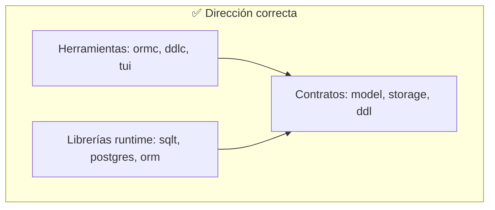
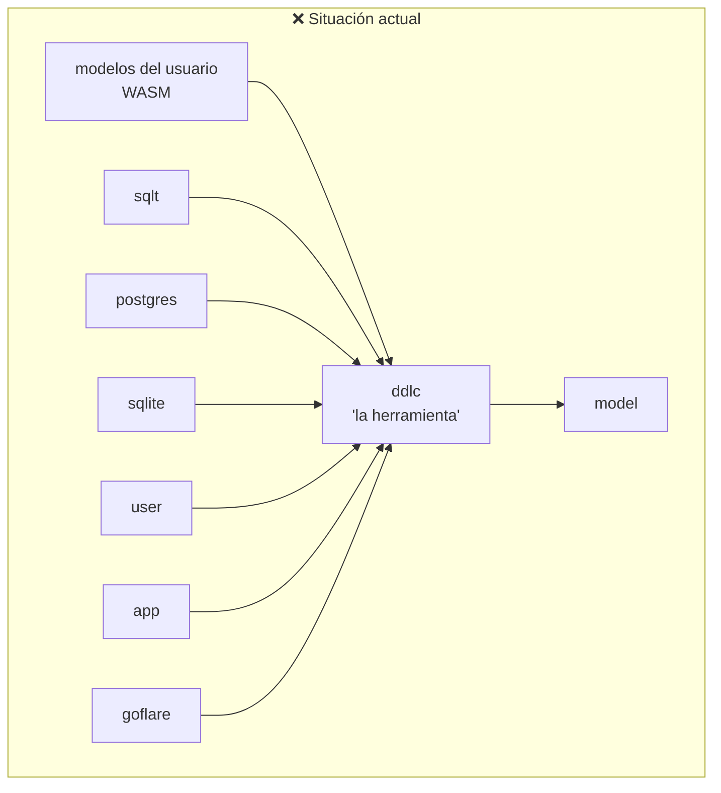
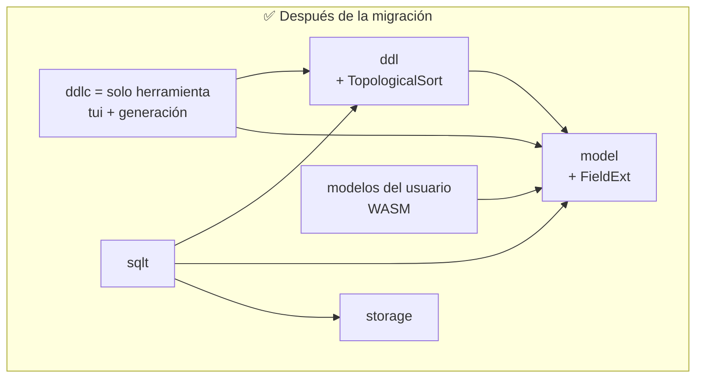

# Propuesta: reubicar los contratos que hoy viven en `ddlc`

> **Estado:** propuesta — pendiente de aprobación. No hay plan de ejecución todavía.
> **Origen:** revisión de `sqlt/go.mod` (2026-07-17): ¿por qué `sqlt` depende de `ddlc`?

---

## 1. El problema en una frase

`ddlc` debería ser **la herramienta de generación de DDL** (como `ormc` lo es para el ORM),
pero hoy adentro de `ddlc` viven **tipos de contrato que las librerías de runtime necesitan**.
Resultado: 13 `go.mod` del ecosistema importan "la herramienta", incluso código que compila a WASM.

## 2. Qué contiene `ddlc` hoy (verificado en el código)

El paquete raíz de `ddlc` tiene solo **3 archivos**:

| Archivo | Qué es | Quién lo usa realmente |
|---|---|---|
| `field_ext.go` → `FieldExt` | **Un tipo de datos**: metadata de foreign key (`Ref`, `RefColumn`, `OnDelete`) que los modelos declaran en su método `SchemaExt()` | Los **modelos** (runtime, WASM incluido) y los compiladores SQL (`sqlt`, `postgres`) |
| `sort.go` → `TopologicalSort` | **Un algoritmo puro**: ordena tablas para que `users` se cree antes que `sessions` (que la referencia por FK) | Los compiladores SQL al exportar el esquema completo |
| `exporter.go` → `Exporter` | **Una interfaz**: `ExportDDL(models) (string, error)` | El tooling de generación que escribe `schema.sql` |

Aparte está `tui/` (la herramienta interactiva de migraciones) — **eso sí es herramienta**.

O sea: `ddlc` es hoy una mezcla de *contrato + algoritmo + herramienta* en un solo módulo.

## 3. El principio que se está violando

**Principio de dependencias estables**: las dependencias deben apuntar hacia lo **estable**
(contratos, tipos, abstracciones). Las **herramientas son detalles volátiles**: dependen de los
contratos, pero **nada debe depender de ellas**.

Hoy la flecha está invertida: `sqlt` (runtime) y hasta los **modelos del usuario** (que compilan
a WASM) dependen de `ddlc` (herramienta). Cada modelo con una foreign key arrastra la herramienta
de generación dentro del binario del frontend.

La pista de que algo anda mal ya está escrita en el propio `ddlc/go.mod`:

> *"Leaf guarantee: ddlc must remain a leaf package… to keep it portable for WASM/frontend"*

Una **herramienta** jamás necesitaría garantizar ser "portable a WASM". Tuvo que autoimponerse
esa restricción porque tiene contratos de runtime viviendo adentro. La garantía es el síntoma,
no la solución.

## 4. Propuesta: cada pieza a su dueño natural

| Pieza | Va a | Por qué |
|---|---|---|
| `FieldExt` | **`model`** | Es metadata de esquema que **declaran los modelos** (`SchemaExt()` es un método del modelo). `model.FieldDB` ya guarda PK/AutoInc/Unique — la FK es la misma familia. El que declara el dato es dueño del tipo. |
| `TopologicalSort` | **`ddl`** | Es un problema 100% de DDL: ordenar los `CREATE TABLE` según dependencias de FK. `ddl` es el contrato DDL que `sqlt`/`postgres` ya implementan. No suma dependencias (opera sobre `model`). |
| `Exporter` | **el consumidor** (el tooling de generación) | Idioma Go: la interfaz la define **quien la llama**, no quien la implementa. Por tipado estructural, `sqlt` implementa `ExportDDL` sin importar la interfaz. El `var _ ddlc.Exporter` en `sqlt` se elimina. |
| `tui/` | **se queda en `ddlc`** | Eso sí es la herramienta. |

## 5. Qué gana cada repo

- **`sqlt/go.mod`** queda en `storage + ddl + model + fmt` — cero `ddlc`. Lo mismo aplicaría a
  `postgres` y `sqlite`.
- **Los modelos del usuario** (código WASM) solo importan `model`, que es donde ya viven
  `Field` y `FieldDB`. Nunca más una herramienta dentro del binario frontend.
- **`ddlc`** queda siendo solo lo que su nombre promete: la herramienta de generación/migración,
  en la **cima** del grafo. Puede crecer (deps de tui, generadores, lo que sea) sin contaminar
  a nadie, porque nadie depende de ella. Se borra la "leaf guarantee": ya no hace falta.

## 6. Costo (el precio de arreglarlo)

Es un **breaking change en cascada**, mecánico pero ancho:

1. `model`: gana `FieldExt` (y opcionalmente una interfaz `SchemaExtender`) → bump minor.
2. `ddl`: gana `TopologicalSort` → bump minor.
3. Migran el import `ddlc.FieldExt` → `model.FieldExt` y `ddlc.TopologicalSort` →
   `ddl.TopologicalSort`: `sqlt`, `postgres`, `sqlite`, `ormc`, `user`, `app`, `goflare`,
   `goflare-demo`, `sqlmcp` (los 13 go.mod que hoy importan `ddlc`).
4. `ddlc`: elimina los 3 archivos del raíz, conserva `tui/`, define `Exporter` localmente
   si su tooling lo necesita → bump major (o minor pre-1.0 con `!`).

La cascada de `gopush` propaga los bumps en orden topológico como siempre.

## 7. Decisión pendiente

- [ ] ¿Aprobar el reparto `FieldExt`→`model`, `TopologicalSort`→`ddl`, `Exporter`→consumidor?
- [ ] Si se aprueba: redactar el plan de migración detallado (orden de publicación, repos, etapas).
