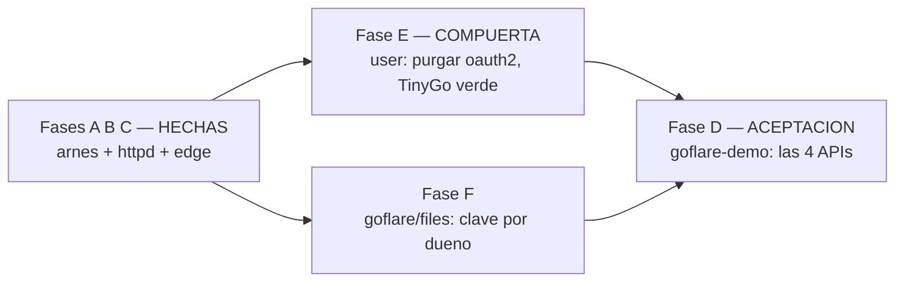

# MASTER PLAN — Las cuatro APIs, demostradas en Cloudflare de verdad

Hub de coordinación multi-repo. `goflare-demo` pasa a demostrar **cuatro** APIs —**router, D1,
archivos y autenticación**— con login real de Google, registro, y **un archivo por usuario que
se reemplaza al subir otro**.

> Dispatch: 2026-07-13 · **Estado: ☐ PENDIENTE**
> Doctrina: `app/docs/CONSTRUCTION_HARNESS.md`.
> Depende de: `ROUTER_CONFORMANCE_MASTER_PLAN.md` — **Fases A, B y C ya implementadas** (el
> arnés de conformidad, `server/httpd` con patrón por método, y `goflare/edge` con
> `Config{Authn, Authorize}`). Sin ellas, una ruta con permisos es un 403 eterno y nada de
> esto puede funcionar.

---

## 1. El hallazgo que dispara este plan

`tinywasm/user` se declara **edge-ready** (commit `b67a8cc`) y **compila a wasm**… con el
compilador de Go. Pero **el borde se compila con TinyGo**, y ahí revienta:

```
# net/http
tinygo/src/net/http/roundtrip_js.go:73:12: t.roundTrip undefined
```

La cadena es corta y letal: `user/server/oauth.go` → `golang.org/x/oauth2` → `net/http` →
**TinyGo no lo soporta**. O sea: **`user` no puede entrar en un Worker hoy**, y la etapa que
lo declaró edge-ready lo verificó con el compilador equivocado.

Es exactamente la clase de fallo que este ecosistema se ha propuesto eliminar: verde en los
tests, imposible en producción. Y lo destapa `goflare-demo`, que es su trabajo.

**Lo bueno: el daño está acotado.** Medido, no supuesto:

- `bcrypt` y `tinywasm/fetch` **sí** compilan con TinyGo.
- `GetUserInfo` **ya** usa `tinywasm/fetch`.
- El único que arrastra `net/http` es `ExchangeCode`, vía `oauth2.Config.Exchange`.

## 2. Por qué encaja sin forzar nada

`user` **ya expone los dos asientos exactos** que pide `edge.Config`. No hay que inventar un
puente:

| `edge.Config` pide | `user` ya tiene |
|---|---|
| `Authn router.Middleware` | `func (m *Module) Authenticate() router.Middleware` |
| `Authorize model.Authorizer` | `func (m *Module) Can(userID string, r model.Resource, a model.Action) bool` — **es la firma de `model.Authorizer`** |

Que las piezas encajen sin adaptador es la señal de que el contrato estaba bien puesto. El
demo solo tiene que **cablearlas**.

## 3. Grafo de dependencias



- **E es la compuerta**: sin ella `user` no entra en un Worker y no hay autenticación posible.
- **E y F son independientes** entre sí: repos distintos, se despachan en paralelo.
- **D es la aceptación**: el único sitio donde se demuestra que las cuatro funcionan **en
  Cloudflare de verdad**.

## 4. Planes por librería

| Fase | Librería | Plan | ¿Rompe API? | Estado |
|------|----------|------|-------------|--------|
| **E (compuerta)** | `tinywasm/user` | [user/docs/PLAN_TINYGO_OAUTH.md](https://github.com/tinywasm/user/blob/main/docs/PLAN_TINYGO_OAUTH.md) | **Sí** — `OAuthProvider` deja de hablar `*oauth2.Token` | ☐ |
| **F** | `tinywasm/goflare` | [goflare/docs/PLAN_STAGE_4_FILES_PER_OWNER.md](https://github.com/tinywasm/goflare/blob/main/docs/PLAN_STAGE_4_FILES_PER_OWNER.md) | No — adición (`PerOwner()`) | ☐ |
| **D (aceptación)** | `tinywasm/goflare-demo` | [goflare-demo/docs/PLAN_FOUR_APIS.md](https://github.com/tinywasm/goflare-demo/blob/main/docs/PLAN_FOUR_APIS.md) | No — consumidor | ☐ |

## 5. La regla que gobierna las tres fases

**TinyGo es el compilador que decide.** `go build` y `GOOS=js go build` **no prueban nada**
sobre el borde: los dos dan verde hoy sobre código que TinyGo rechaza. Todo criterio de
aceptación que hable de wasm debe ejecutarse con TinyGo:

```bash
tinygo build -target=wasm -o /dev/null ./...
gotest -tinygo
```

Si un plan de esta familia dice "compila a wasm" y lo verifica con el compilador de Go, **el
plan está mal escrito**.

## 6. Configuración manual en Cloudflare (no la hace ningún agente)

- Secretos del Worker: `GOOGLE_CLIENT_ID`, `GOOGLE_CLIENT_SECRET`.
- En la consola de Google Cloud, registrar la URL de callback:
  `https://goflare-demo.pages.dev/oauth/callback/google`.
- El bucket R2 (`goflare-demo-files`) y el binding `FILES`, ya documentados en
  `goflare-demo/docs/CI_D1_SETUP.md`.

## 7. ⚠️ Compuerta de publicación

Sigue en pie la decisión de **no publicar `server` hasta rediseñar la cascada de `gopush`**.
Las Fases A–C están implementadas con `replace` local. Esta familia (E, F, D) hereda esa
compuerta: se desarrolla con `replace`, y **la publicación de todo el conjunto se decide de
una vez**, no repo a repo.
