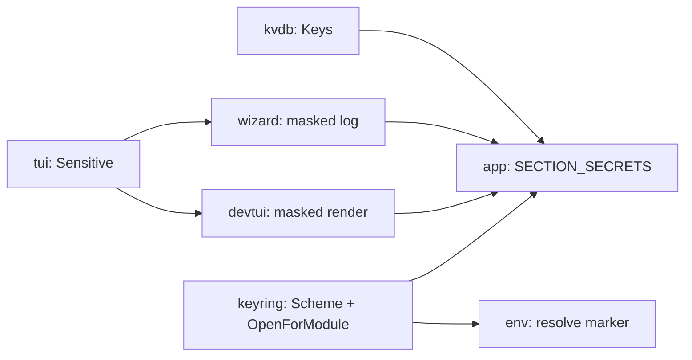

# MASTER_PLAN — `.env` secrets live in the keyring, never on disk

> Orquestador multi-repo. Cada módulo tiene su plan autocontenido en `docs/`.
> Despacho vía CodeJob workflow (skill: `agents-workflow`).
> Idioma: español para este índice; cada `docs/PLAN.md` de módulo está en
> inglés, como el resto del ecosistema (`CONSTRUCTION_HARNESS.md`).
> Origen: `veltylabs/misitio` no arrancaba en local porque su `.env` no podía
> llevar `IAM_CLIENT_SECRET` en texto plano (decisión del mantenedor,
> 2026-08-27) y el ecosistema no tenía ninguna forma de declarar "este valor
> vive en el keyring" sin inventar una convención ad-hoc por proyecto.

## 0. Contexto — cómo se llegó a este diseño

`tinywasm/app` ya usa `tinywasm/keyring` (`keyring.OpenKeyring("devflow")` en
`app/start.go`, credenciales de GitHub) y `tinywasm/keyring` trae su propio
`KeyManager` (namespace `"updater-cicd"`, HMAC secret + GitHub PAT) — ninguno
de los dos generaliza a "secretos arbitrarios por variable de un proyecto
cualquiera". El primitivo de bajo nivel (`Keyring.Get/Set/Delete(key)`,
`keyring/auto` con 4 backends por plataforma) ya es genérico y no necesita
cambios.

Se decidió en chat, con el mantenedor, antes de escribir un solo plan:

1. **Dónde se resuelve el marcador** `KEY=keyring://`: en `tinywasm/env`
   (`Lookup`/`LookupAt`, solo `!wasm`) — no en `tinywasm/app` inyectando
   variables de entorno al subproceso — porque `env.Get` es el único punto
   que **todo** consumidor ya llama, sin importar si el proceso lo arrancó
   `tinywasm -mcp`, `tinywasm -tui`, o un `go run` a mano.
2. **Sintaxis del marcador**: `KEY=keyring://` (esquema de URI, mismo idioma
   que `op://vault/item` de 1Password) — autoexplicativo sin documentación,
   sin cuerpo (`service`/`key` ya se conocen del contexto).
3. **Namespace del keyring**: automático, el `module` de `go.mod` del
   proyecto activo — cero configuración nueva, ya es único.
4. **`tinywasm -mcp` (headless) sin secreto**: falla alto por el camino que
   ya existe (`app_get_logs` ya muestra el fallo rápido del propio
   consumidor), con un log adicional que remite a `-tui`. Sin tool MCP nueva.
5. **Fuga de texto plano encontrada durante el diseño** (no cosmética):
   `wizard.Wizard.Change` loguea el valor crudo de cualquier step al avanzar,
   y ese log viaja por SSE (`GET /logs`, y `app_get_logs` por MCP). Se cierra
   con una capacidad `Sensitive` en el harness (`tinywasm/tui`), consumida por
   `tinywasm/devtui` (pantalla) y `tinywasm/wizard` (log), no con una
   implementación de bolsillo que evite el problema en este único caso.

## 1. Los siete módulos de esta ola

| # | Módulo | Qué agrega | Depende de | Plan |
|---|---|---|---|---|
| 1 | `tinywasm/kvdb` | `KVStore.Keys() []string` — enumerar lo guardado, hoy solo `Get`/`Set` | ninguno | [`kvdb/docs/PLAN.md`](https://github.com/tinywasm/kvdb/blob/main/docs/PLAN.md) |
| 2 | `tinywasm/tui` | `Sensitive interface { Sensitive() bool }` — capacidad opcional, aditiva | ninguno | [`tui/docs/PLAN.md`](https://github.com/tinywasm/tui/blob/main/docs/PLAN.md) |
| 3 | `tinywasm/keyring` | `Scheme`/`IsReference` (el marcador) + `auto.OpenForModule(dir)` (namespace por `go.mod`) | ninguno | [`keyring/docs/PLAN.md`](https://github.com/tinywasm/keyring/blob/main/docs/PLAN.md) |
| 4 | `tinywasm/devtui` | Enmascara el valor en pantalla mientras se escribe, si el handler es `Sensitive` | 2 | [`devtui/docs/PLAN.md`](https://github.com/tinywasm/devtui/blob/main/docs/PLAN.md) |
| 5 | `tinywasm/wizard` | `Step.Sensitive`; `Wizard.Change` deja de loguear el valor crudo de un step sensible; `Wizard.Sensitive()` | 2 | [`wizard/docs/PLAN.md`](https://github.com/tinywasm/wizard/blob/main/docs/PLAN.md) |
| 6 | `tinywasm/env` | `Lookup`/`LookupAt` (nativo) resuelven `keyring://` vía `auto.OpenForModule("."`); wasm lo rechaza en vez de devolverlo literal | 3 | [`env/docs/PLAN.md`](https://github.com/tinywasm/env/blob/main/docs/PLAN.md) |
| 7 | `tinywasm/app` | Sección `SECRETS`: detecta `.env` marcado sin valor en el keyring (vía `h.DB`, nunca el archivo crudo — `AGENTS.md`), pide cada uno con un wizard `Sensitive`; headless solo loguea y sigue | 1, 3, 5 (y 4 para que el enmascarado en pantalla sea real) | [`app/docs/PLAN.md`](https://github.com/tinywasm/app/blob/main/docs/PLAN.md) |

## 2. Grafo de dependencias — orden de despacho

- **Fase A (paralelo, sin dependencias entre sí):** `kvdb`, `tui`, `keyring`.
- **Fase B (paralelo, cada uno depende solo de un módulo de A):** `devtui` y
  `wizard` (← `tui`), `env` (← `keyring`).
- **Fase C (gate final):** `app`, depende de `kvdb` + `wizard` + `devtui` +
  `keyring` de las fases A/B. No depende de `env` — `env` lo consume cada
  proyecto cliente (`veltylabs/misitio`, etc.), no `tinywasm/app` mismo.

`env` y `app` son ramas independientes desde la fase A/B: `env` no bloquea a
`app` ni viceversa. Despachar en orden de fase (A completa → B completa → C)
evita que un `go get` intermedio traiga una versión sin publicar todavía.

## 3. Consumidor de prueba — fuera de esta ola

Per `tinywasm/app-releases/docs/CONSTRUCTION_HARNESS.md` ("An API is not
published until a consumer-shaped test... proves it"): una vez las 7
publiquen, `veltylabs/misitio` cambia su `.env` a
`IAM_CLIENT_SECRET=keyring://` (URLs no-secretas como `IAM_BASE_URL`/
`MISITIO_BASE_URL` quedan literales — no son credenciales) y ejecuta
`tinywasm -tui` una vez para cargarlo vía la sección `SECRETS`. Esa migración
es su **propio** plan, escrito después de que esta ola cierre — no incluido
aquí.

## Reglas de despacho para los agentes de esta ola

- Ningún módulo de la fase B/C hace `go get` de una dependencia de esta ola
  antes de que el `docs/PLAN.md` correspondiente diga explícitamente que ya
  publicó (cada plan de módulo ya trae esa advertencia en su propio
  encabezado — no la quites al ejecutar).
- Ante un conflicto real entre esta ola y cualquier otra en curso en el mismo
  repo: **STOP** y repórtalo al mantenedor, no lo resuelvas localmente.
