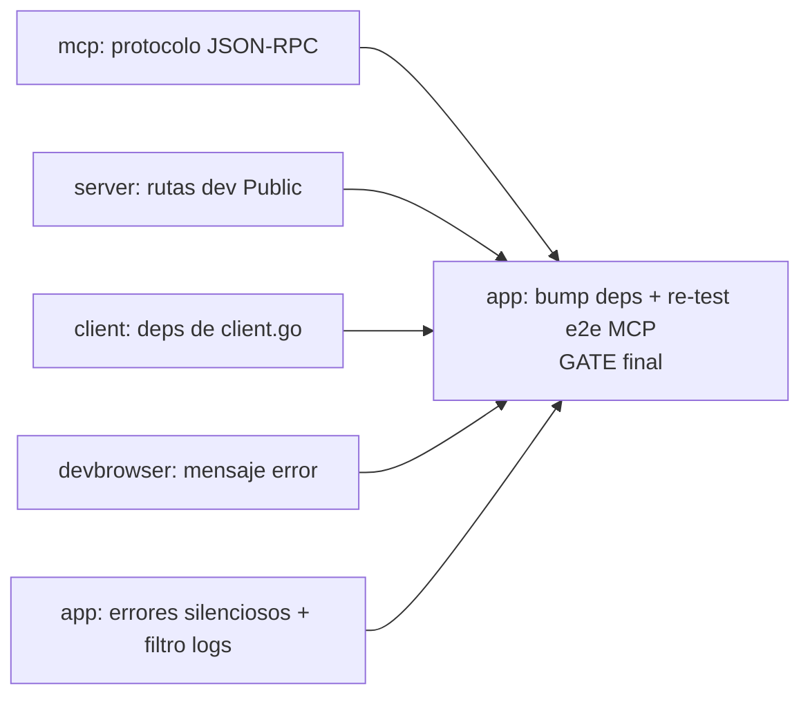

# MASTER_PLAN — Hardening del daemon MCP: errores silenciosos, protocolo y dev loop

> Orquestador multi-repo. Cada módulo tiene su plan autocontenido en `docs/`.
> Despacho vía CodeJob workflow (skill: `agents-workflow`).
> Orden de despacho entre olas y avance: [ROADMAPS_PLANS.md](ROADMAPS_PLANS.md).
> Idioma: español (decisión del mantenedor).
> Origen: sesión de prueba real del daemon (2026-07-09) donde un LLM interactuó
> **solo** con el MCP (`tinywasm -mcp`, curl JSON-RPC contra `:6060/mcp`).

## 0. Contexto — cómo se encontraron estos bugs

Con la migración a `mcp.Tool` tipada (v0.1.19) ya verificada (`tools/list` emite
los 25 tools con inputSchema generado válido; `req.Bind` valida `NotNull`), se
ejercitó el flujo completo que viviría un LLM: `initialize`, `tools/list`,
`tools/call` con argumentos válidos/inválidos, proyecto real mínimo
(`go.mod` + `web/main.go`), y los métodos custom `tinywasm/state|action`.

**Lo que ya funciona** (no tocar): validación `NotNull` vía Bind
(`start_development` sin `project_path` → `isError`), tool inexistente → error
JSON-RPC `-32602`, errores claros de db/browser sin proyecto activo, `quit`,
arranque real (server 8080 + watcher + browser chromedp).

## 1. Hallazgos por módulo

| # | Módulo | Bug | Severidad | Plan |
|---|--------|-----|-----------|------|
| 1 | `app` | `start_development` con path inexistente responde éxito y el fallo es 100% silencioso (sin log de error, loop colgado) | alta | `app/docs/PLAN.md` |
| 2 | `app` | Filtro `section` de `app_get_logs` compara `TabTitle` pero las líneas muestran `HandlerName` → `section=CLIENT` da "No logs available yet" | alta (trampa para LLM) | `app/docs/PLAN.md` |
| 3 | `app` | `tinywasm/action` con key desconocida responde `"OK"` | media | `app/docs/PLAN.md` |
| 4 | `server` | `GET /` → **403 Forbidden** en dev: RBAC privado-por-defecto bloquea la raíz; el browser solo muestra "Forbidden" → dev loop visual roto | **crítica** | `server/docs/PLAN.md` |
| 5 | `client` | `client.go` generado importa `tinywasm/dom\|fmt\|html` sin agregarlas a `go.mod` → build inicial falla en proyecto mínimo | alta | `client/docs/PLAN.md` |
| 6 | `mcp` | `initialize` rechaza versiones intermedias (`2025-06-18`, `2025-03-26`) con error `-32602`; solo acepta `2024-11-05` y `2025-11-25`. La spec exige responder con una versión soportada | alta | `mcp/docs/PLAN_JSONRPC_PROTOCOL_COMPLIANCE.md` |
| 7 | `mcp` | `id` numérico devuelto como string (`id:3` → `"id":"3"`) — viola JSON-RPC 2.0 | alta | `mcp/docs/PLAN_JSONRPC_PROTOCOL_COMPLIANCE.md` |
| 8 | `devbrowser` | Mensaje de error referencia un tool inexistente: "open it first with `browser_open`" (no está en `tools/list`) | baja | `devbrowser/docs/PLAN.md` |
| 9 | `app`/`json` | `Bind` tolera tipos incorrectos (`lines:"cinco"` en campo int se ignora sin error) | baja — documentado en plan de app como decisión pendiente | `app/docs/PLAN.md` §nota |

### Pregunta abierta para el mantenedor (no bloquea)

Al correr `tinywasm -mcp` **desde el directorio de un proyecto**, el daemon
compiló el proyecto del CWD al arrancar (generó `web/public/client.wasm` sin que
ningún cliente llamara `start_development`). ¿Es intencional para un daemon
"global"? Si no, agregarlo al plan de `app`.

## 1.b Coordinación con la ola Kind unification (`docs/KIND_UNIFICATION_MASTER_PLAN.md`)

`tinywasm/model` ya publicó un **breaking change**:
`Field.Type` pasa de enum a interfaz `Kind`, y los kinds de composición ahora
reciben su `*Definition` en el constructor (`model.Struct(ref)` /
`model.StructSlice(ref)`); `Field.Ref` queda SOLO como FK escalar.
`mcp/model.go` todavía usa la sintaxis vieja (`Type: model.FieldStruct,
Ref: &x`), válida contra la versión de `model` que `mcp` tiene pineada hoy.

**Regla para los agentes de este master plan:** los planes de módulo (mcp,
app, server, client, devbrowser) NO bumpean `tinywasm/model` ni migran
Definitions — eso pertenece a la fase B/C de la otra ola. Si un fix requiere
tocar un literal `model.Field`, se mantiene la sintaxis de la versión pineada
en el `go.mod` del módulo. Ante conflicto real entre ambas olas: STOP y
reportar al mantenedor.

## 2. Grafo de dependencias

Todos los planes de módulo son **paralelos** (no comparten archivos ni API).
El único gate es la verificación e2e final en `app`, que necesita las versiones
publicadas de los demás.

- **Paralelo:** mcp, server, client, devbrowser.
- **`app` va al FINAL, en una sola pasada** (es la herramienta principal e
  integra a los demás): tras publicar los cuatro módulos (mantenedor,
  herramienta local — jamás el agente), `app` ejecuta sus fixes propios +
  bump de deps + la sesión de prueba MCP completa (checklist en
  `app/docs/PLAN.md` §verificación). Tocar app antes = re-testear todo dos
  veces.
- **Alcance ampliado del plan de app (decisión 2026-07-10):** etapa 4 "browser
  lifecycle" — el daemon crea su browser SIEMPRE headless (el LLM ve por
  screenshots; sin ventana robando foco ni fallo sin display); ventana visible
  solo al attach del TUI (actions nuevas `browser_show`/`browser_hide`,
  relanzando la única instancia); salir del TUI ya NO manda `quit` (no mata el
  trabajo del LLM — modo a la par); el cliente deja de crear su propio browser
  (cierra la regresión de doble ventana). devbrowser NO se toca: su API
  (`SetHeadless`/`CloseBrowser`/`OpenBrowser`) ya alcanza.

## 3. Criterio de cierre del master plan

Repetir la sesión de prueba original contra el daemon recompilado y verificar:

1. `initialize` con `protocolVersion: "2025-06-18"` → responde con versión
   soportada (no error).
2. `id` numérico se devuelve numérico.
3. `start_development` con path inexistente → `isError` inmediato con mensaje
   claro; nada queda colgado.
4. `app_get_logs section=CLIENT` devuelve las líneas de CLIENT; `section=?`
   lista las secciones que las líneas realmente muestran.
5. Proyecto mínimo: build inicial **verde** (deps agregadas) y `GET /` → 200
   con el index generado; el browser automatizado muestra la app, no "Forbidden".
6. `tinywasm/action` con key desconocida → error, no `"OK"`.
