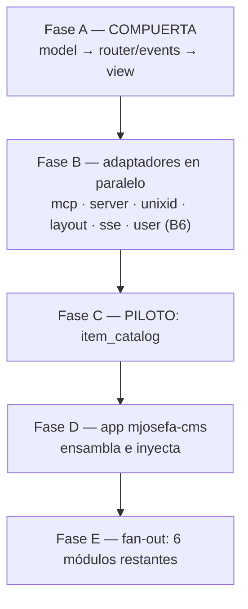
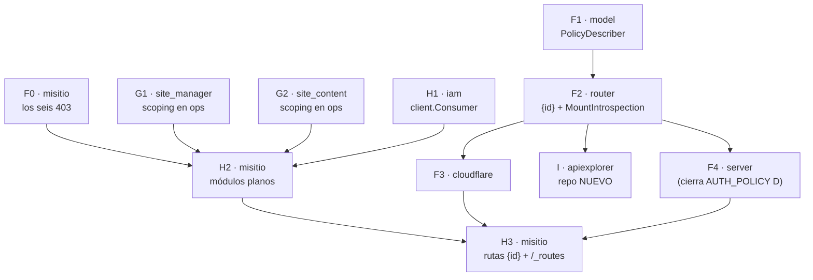

# MASTER PLAN — Módulos reutilizables: acoplados solo a contratos tipados

Hub de coordinación multi-repo. Cierra el acoplamiento que impedía reutilizar y **testear** un
módulo de dominio (`veltylabs/modules/*`): dependían de implementaciones concretas (`mcp`, `json`,
`unixid`) y no declaraban su propia vista. El detalle normativo (whitelist de imports, límite con
la stdlib, no-map/no-reflect, testing contra `storage/mem`) vive en **un solo lugar**:
[`veltylabs/modules/AGENTS.md`](https://github.com/veltylabs/modules/blob/main/AGENTS.md) (canónico,
copiado verbatim en cada módulo). Este documento solo coordina: estado, orden y decisiones cerradas.

> Dispatch: 2026-07-15 · Última rectificación: **2026-08-26** (ola F–I: superficie de API
> introspectable; ver §5). Anterior: 2026-07-18
> ([auditoría](AUDITORIA_ARQUITECTURA_MJOSEFA_CMS.md)). **El estado por pieza es la columna
> "Estado" de §1 — única fuente; no se duplica aquí.**
> Doctrina: [`CONSTRUCTION_HARNESS.md`](CONSTRUCTION_HARNESS.md) · Antecedentes:
> [`ROUTER_CONFORMANCE_MASTER_PLAN.md`](ROUTER_CONFORMANCE_MASTER_PLAN.md),
> [`CRUD_HARNESS_MASTER_PLAN.md`](CRUD_HARNESS_MASTER_PLAN.md).

---

## 1. Estado por pieza

Fase A (compuerta) se implementó directo, sin CodeJob. Fases B–E se despachan vía CodeJob, un repo
por plan, cada plan autocontenido (enlaces cross-repo = URLs de GitHub). El "qué cambia" completo
vive en el `docs/PLAN.md` de cada repo — aquí solo la línea de identidad.

| Fase | Repo | Qué | ¿Rompe API? | Estado |
|---|---|---|---|---|
| A1 | `model` | `IDGenerator{NewID()}` | No | ✅ `v0.0.15` |
| A2 | `router` | 3 olas: `Route.Accepts` + `Context.Decode/Encode` (`v0.1.12`), `Caller.Call` tipado (`v0.1.13`), `OpRegistry`/`OpModule` fuera de la interfaz gorda (`v0.1.14`) | Sí, en implementadores | ✅ `v0.1.14` |
| A3 | `view` (nuevo) | `Presenter` + `view.New(...)` + `mock` + `conformance` | N/A | ✅ `v0.1.0` |
| A4 | `events` (nuevo) | `Publisher`/`Subscriber`/`Broker`/`Event` + `mock` + `conformance` | N/A | ✅ `v0.0.2` |
| B1 | `mcp` | [`PLAN`](https://github.com/tinywasm/mcp/blob/main/docs/PLAN.md) — `HarvestOps(...OpModule)`, `Caller` tipado | **Sí**: `Tools()` → `MountOps` | ✅ `v0.2.0` |
| B2 | `server` | httpd: `Context.Decode/Encode`; se cae la proyección `/op` | No en consumidores | ✅ `v0.2.32` |
| B3 | `unixid` | `GetNewID` → `NewID()`, `SetNewID(*string)` — satisface `IDGenerator` | Sí (renombre) | ✅ `v0.2.24` |
| B4 | `layout` | `crudview` = solo renderer: `Config{ParentID, Presenter}` | **Sí** | ✅ `v0.0.14` |
| B5 | `sse` | Servidor: `sse.Publisher` (adapta a `events.Publisher`) ✅ `v0.1.1`. Resta: `events.Subscriber` wasm sobre `SSEClient.OnMessage`, `events.Fanout` (aditivo en `events`), y montaje seguro en el app (canal desde `ctx.UserID()`, jamás elegido por el cliente — auditoría §4) | No (aditivo) | 🟡 mitad servidor publicada; resto sin plan |
| B6a | `user` | Fix del drift `orm v0.11` (mismo que C): `ddl.Sync`+`TopologicalSort`, `ErrNotFound`, `ddlc→model.FieldExt` (PR #18, con corrección de review: bump `unixid v0.2.24`, no revert a `GetNewID`). Origen: `mjosefa-cms` lo parcheaba con forks locales (`local_orm` con `CreateTable` no-op que silenciaba el esquema de auth) | No | ✅ **publicado `v0.0.37`** (2026-07-18) — `mjosefa-cms` ya puede borrar sus forks/`replace` |
| B6b | `user` | [`user/docs/PLAN.md`](https://github.com/tinywasm/user/blob/main/docs/PLAN.md) (promovido desde la cola al cerrar B6a) — alineación al patrón: `Config.IDs`/`Config.Events`, `TopicSecurity`, `MountOps` (op `me` + ops CRUD `list_users`/`upsert_user`/`delete_user` gated `Requires("users",…)`), codec vía `Context`, **y vista admin de usuarios `user.NewView(caller)`** (requerida por `mjosefa-cms`); excepciones documentadas (`MountAPI`, `jwt`/crypto, `fetch`+`json` solo `oauth.go`) | **Sí** (`v0.1.0`) | ☐ **listo para dispatch** (gate B6a cumplido 2026-07-18) |
| C | `item_catalog` (piloto) | `OpModule` + `view.New` + `Deps{IDs, Publisher}`; validó el patrón end-to-end | **Sí** | ✅ mergeado (`c6f90d0`) · 🔴 roto por el drift `orm v0.11` (fix en su `docs/PLAN.md`) · ⚠️ **nuevo drift detectado 2026-07-18**: `view v0.1.2` rompió `view.New` (sin `project` posicional ni `WithFill`; proyección vía `view.Itemizer` en el registro; `Save/Delete` → `Saver`/`Deleter`) — `item_catalog v0.3.0` usa la API vieja y romperá cuando un consumidor resuelva `view ≥ v0.1.2` (B6b/`user v0.1.0` la requiere). Añadir la migración al mismo fix pendiente de su `docs/PLAN.md` |
| D | `mjosefa-cms` | Composition root: cosecha `HarvestOps`, inyecta `unixid`/`httpd`/`crudview`/broker | Consumidor | 🟡 PR #3 en corrección; B6a publicada → borrar `replace`/forks y pinear `user v0.0.37` YA |
| E | `agent_switch`, `appointment_booking`, `business_hours`, `clinical_encounter`, `provider_payouts`, `work_schedule` | Réplica del patrón validado por C | **Sí** c/u | 🟡 docs en rectificación; código **gated** hasta C+D verdes (§4) |

## 2. El patrón en una frase (+ la única aclaración que no vive en AGENTS.md)

Un módulo importa **contratos y puertos** — `model`, `router`, `view`, `events`, más `orm`/
`storage`/`ddl` para persistencia — y recibe inyectado todo lo concreto (generador de id,
transporte, codec, renderer, broker, backend de storage). Whitelist completa y justificación
puerto-vs-implementación: `AGENTS.md` canónico.

**Historia que explica dos roturas (C y B6a):** `orm.DB.CreateTable` fue removido — el schema
runtime se extrajo al sibling `tinywasm/ddl`. `ddl.Compiler` es capacidad opcional del backend
(SQL sí; `storage/mem` no — crea tablas perezosamente): el módulo hace *type assertion* sobre
`db.RawConn()` y, sin la capacidad, migrar es un no-op **legítimo** (solo en tests/mem; un no-op
*hardcodeado* contra un backend SQL es el anti-patrón que la auditoría encontró en `mjosefa-cms`).

## 3. Decisiones cerradas (no re-litigar)

- **Aguas arriba, nunca fork local.** Ni wrapper adaptador, ni `internal/`, ni `replace` a carpeta
  local, ni interfaz local que duplique un contrato: el defecto se corrige en el repo dueño y se
  republica. Violaciones vivas: `work_schedule` (`replace` a `mcp`, se cierra en su Fase E) y los
  forks de `mjosefa-cms` (se cierran con B6a).
- **La vista se declara en el módulo** (`view.Presenter`); el app solo acopla el renderer. `layout`
  nunca es contrato.
- **Ni `mcpd` ni partir `mcp`**: `mcp` ya depende solo de `router`; un paquete "mcp-contrato" no
  tendría consumidor.
- **El app integra al final, en una sola pasada** — por eso B1/B4 publicados dejaron `mjosefa-cms`
  en rojo hasta Fase D: es el hallazgo del acoplamiento, no una regresión.
- **`AGENTS.md` canónico por módulo** (2026-07-17): vive en `veltylabs/modules/AGENTS.md`, cada
  módulo lo copia verbatim y solo llena "Domain-specific notes"; los planes lo referencian en vez
  de re-inlinear contratos.
- **`clinical_encounterOld` no se toca** (legado sin importadores, fuera de alcance).

## 4. Grafo y gate de Fase E



**Gate:** Fase E no despacha código hasta que C y D estén verdes.

> **Verificado 2026-08-26: la compuerta está abierta.** `go build ./...` limpio en
> `veltylabs/item_catalog` (C) y en `veltylabs/mjosefa-cms` (D). Los estados 🔴/🟡 de §1 para
> esas dos filas quedaron obsoletos; el drift de `orm v0.11` y de `view v0.1.2` ya está
> resuelto en el código. Fase E y la ola F–I (§5) pueden despachar.

Criterio de verde para C (y para
cada módulo de E al replicar):

- Blacklist limpia en todo el repo, tests incluidos: `grep -rn "tinywasm/mcp\|tinywasm/json\|
  tinywasm/unixid\|tinywasm/sqlite\|tinywasm/sqlt\|tinywasm/postgres\|tinywasm/layout" .` vacío
  (tests con `storage/mem`, nunca un driver).
- `var _ router.OpModule = (*Module)(nil)` compila; vista vía `view.New(...)`; `Deps{IDs,
  Publisher}` inyectados; schema propio vía `ddl` (§2).
- Tests en el repo del módulo: `Presenter` con caller falso (ambos targets), `MountOps` contra
  `router/mock` (op + RBAC), eventos contra publisher falso. `gotest ./...` verde stdlib + wasm.
- Si un test del patrón resulta incómodo de escribir, el defecto es del contrato (Fase A/B): se
  corrige aguas arriba y se republica — nunca se parcha en el módulo.

---

## 5. Ola F–I (2026-08-26) — que la superficie de API se pueda leer, auditar y probar

Extensión del mismo patrón hacia el **consumidor** `veltylabs/misitio` y hacia el contrato que
le falta al ecosistema para poder auditarse. No es un tema nuevo: es la consecuencia de §3
("la política es del consumidor") aplicada a un app que hoy no puede responder *quién* tiene
cada permiso.

### 5.1 El hallazgo que la ordena

`veltylabs/misitio` registra once rutas. Cruzando su tabla con su `config/policy.go` —su único
`model.Authorizer`—:

| Rutas | Estado |
|---|---|
| 2 | públicas (`/api/health`, `/api/me`) |
| 3 | alcanzables por `velty_admin` (las de `/api/admin/`) |
| **6** | **exigen un permiso que ningún rol tiene → 403 para todo el mundo, administrador incluido** |

Su política concede solo `velty_admin → access_request:ru` y `velty_admin → site:c`. Nadie
concede `site:r`, `site_content:u`, `site_asset:cd` ni `access_request:c`. Los
`sm.MemberOf(...)` de sus handlers —el control real de inquilino— **nunca se ejecutan**: la
compuerta dispara antes.

Nadie lo vio porque sus tests llaman a los handlers, no al enrutador — el mismo defecto de
método que motivó `ROUTER_CONFORMANCE_MASTER_PLAN.md`.

**La causa raíz no es una línea que falte en una tabla:** `model.Authorizer` es un cierre.
Contesta *¿puede este usuario?* y **ningún tipo del ecosistema puede contestar *¿quién
puede?***. Sin esa pregunta, una política con un permiso huérfano es indetectable.

### 5.2 Duplicación que esta ola salda

| Duplicado | Dónde | Se cierra con |
|---|---|---|
| `config.ResourceSite = "site"`, `ResourceAccessReq` | literales en misitio que repiten `site_manager.ModelName()` y `site_content.ModelName()` | `model.ResourceOf(módulo)` — §3.1 de `AUTH_POLICY` lo creó exactamente para esto |
| `config/policy.go: hasPermission` | reimplementa `model.AnyGrant` | usar `model.AnyGrant` |
| `misitio/authctx/` + `config/iamauth.go` + `config/authzcache.go` | ni una línea de misitio dentro | suben a `veltylabs/iam/client` |
| `misitio/api/` → `config/api.go` → `routes/routes.go` | **tres** copias de cada nombre de ruta | `config/` pasa a ser hoja; se borra `api/` |
| `MeResponse` en `routes/routes.go` **y** en `modules/app/app.go` | dos declaraciones del mismo contrato de cable, sin enlace del compilador | una sola en `config/` |
| `unixid.NewUnixID()` ×6 (incluido uno con el error descartado, en cada montaje del panel) | `edge/`, `web/`, `modules/app/`, 3 tests | `config.New(...)` lo crea una vez |
| Los ops de `site_manager`/`site_content` y los handlers REST de misitio | hacen el mismo trabajo | **no se fusionan en esta ola** — ver 5.5 |

### 5.3 Lo segundo que se midió: la frontera del Worker no existe

`GOOS=js GOARCH=wasm go list -deps ./edge/` en misitio trae `dom`, `form`, `html`, `svg`,
`layout`, `layout/landing`, `layout/platformd`, `auth`, `user`, `view`, `events` y
`veltylabs/sitetheme`. Tres puentes, ninguno un import de interfaz: una constante
(`DefaultModuleID = panel.ModuleIdentidad` — **Go importa paquetes, no archivos**), un alias de
DTO de cuatro strings, y un `auth.User` usado para dar forma a `/api/me`.

Medido con TinyGo (`-target wasm -no-debug`, los flags reales de `sitec`):

| | bytes |
|---|---|
| `edge.wasm` hoy | 662.737 |
| sin el puente `config` → `config/panel` | 646.545 (−16.192) |
| además, sin `auth.User` en el Worker | **644.025 (−18.712, −2,8 %)** |

**El costo real son 18 KB** — la eliminación de código muerto de TinyGo salva casi todo. Se
dice explícito para que nadie lo venda como optimización. Lo que importa es que la frontera
**no existe**: el Worker está en 662 KB de un tope **duro** de 1 MB, y basta una referencia
alcanzable para que entre el kit completo.

Simétrico: como `web/client.go` importa `config/` y `config/` importa `routes/`, **el binario
del navegador lleva los handlers del servidor**.

### 5.4 Estructura de un módulo en un app con Worker capado

`mjosefa-cms/modules/<m>/` es el precedente: `backend.go`, `init.go`, `view.go`, `svg.go`,
**planos, sin subcarpetas**. misitio replica esa nomenclatura, con **una** diferencia forzada
por su plataforma:

`mjosefa-cms` sirve desde un binario nativo sin límite de tamaño, así que su `view.go` puede
importar `crudview`/`platformd` sin consecuencias. El servidor de misitio es un **Worker con
tope duro de 1 MB**, y ambos binarios son `GOARCH=wasm` — una etiqueta `wasm` no los distingue
(así se coló `config/panel`), y ni `goflare` ni `sitec` pasan `-tags` (verificado en sus
fuentes).

La frontera que sí funciona es la que Go ya da gratis: **el paquete**. La regla, y es
verificable con un test:

> Un módulo que `routes/` importa contiene solo contrato: handlers, DTOs y —cuando exista— un
> `view.Presenter` (`view` depende solo de `fmt`/`input`/`model`/`router`: no arrastra nada).
> **Todo lo que toca un renderer vive en `modules/panel/`, que `routes/` nunca importa.**

Cero subcarpetas, cero etiquetas nuevas, y la Restricción #2 de misitio deja de ser un
documento para pasar a ser algo que el compilador impone.

### 5.5 Decisiones cerradas de esta ola (no re-litigar)

- **`PolicyDescriber` va en `model`, no en una librería nueva.** Es el mismo razonamiento de
  `AUTH_POLICY` §3.1: una librería aparte añadiría una dependencia a todos para darles tipos
  que ya podían tener gratis, y separaría el vocabulario de la identidad (`ModuleNaming`,
  `ResourceOf`) que es justo lo que hay que unir.
- **Sintaxis `{id}`, nunca `:id`.** `server/httpd` registra en `net/http.ServeMux`, que
  empareja `{id}` nativo desde Go 1.22. Con `:id` sería segmento literal y las dos
  implementaciones discreparían **en silencio** — la clase exacta de divergencia que
  `ROUTER_CONFORMANCE` existe para cerrar. `{id...}` se **rechaza al registrar**: ServeMux lo
  honra y el runtime edge no.
- **misitio conserva REST; los ops se quedan en los módulos de dominio.** No existe ningún
  `router.Caller` sobre HTTP/fetch en el ecosistema: los únicos implementadores son
  `mcp/caller.go`, el mock, el fake de `view/conformance` y dos `memCaller` de demo — y la
  proyección HTTP de ops se eliminó a propósito (B2). El camino canónico del navegador es
  **MCP** (`mjosefa-cms/config/client.go` usa `mcp.NewCaller(mcp.NewClient(origin, ""))`).
  Migrar misitio a ops no es reorganizar: es montar MCP en un Worker con 380 KB de margen y
  reescribir el panel como `crudview` sobre `Presenter`. Merece su propia medición y su propia
  ola. Lo que sí se hace ahora es `.Accepts(&Args{})` en cada ruta, que es lo que el
  explorador necesita para armar el formulario.
- **`view.Presenter` en `site_manager`/`site_content` queda diferido** por lo mismo: hoy no
  tendría consumidor, y escribir código muerto no es DRY. Lo que sí tiene consumidor inmediato
  es el hueco de seguridad de 5.6.
- **El chequeo por fila se queda en el handler.** Es el patrón multi-inquilino canónico
  (`AGENTS.md` §Multi-tenancy): el rol concede el permiso en general, la condición restringe
  las filas. `.Authenticated()` para operaciones que tocan datos queda **descartado**:
  `AUTH_POLICY` §3.3 lo reserva para operaciones sobre el propio llamante.

### 5.6 Un hueco de seguridad que esta ola destapa

Los ops de `site_manager` **no filtran por pertenencia**: `site_get` lee cualquier `Site` por
id y `site_create` crea sin comprobar nada. Hoy no es explotable porque el único consumidor es
misitio y monta REST, no ops — la seguridad vive en sus handlers. Pero en cuanto alguien
coseche esos ops con `mcp.HarvestOps`, quedan expuestos con solo `site:r`.

Es exactamente lo que `AGENTS.md` §Multi-tenancy prohíbe: *"toda condición UPDATE/DELETE
incluye la columna de tenant; `orm.Eq(X_.Id, id)` a secas es una escritura cross-tenant
esperando a ocurrir"*. Se cierra en la fase G1, **antes** que cualquier cosa que monte ops.

### 5.7 Fases

| Fase | Repo | Plan | Qué | Puerta |
|---|---|---|---|---|
| **F0** | `veltylabs/misitio` | [`PLAN_ACCESO_403.md`](https://github.com/veltylabs/misitio/blob/main/docs/PLAN_ACCESO_403.md) | Los seis 403; `AppPolicy` implementa `PolicyDescriber`; recursos vía `ResourceOf`; test que impide la recaída | ninguna |
| **F1** | `tinywasm/model` | [`docs/PLAN.md`](https://github.com/tinywasm/model/blob/main/docs/PLAN.md) | `RoleGrant`, `PolicyDescriber`, `RolesFor` — junto a `AnyGrant`/`ResourceOf` — ✅ `v0.1.7` (2026-08-26) publicado, `gotest` verde | ninguna |
| **F2** | `tinywasm/router` | [`docs/PLAN.md`](https://github.com/tinywasm/router/blob/main/docs/PLAN.md) | `{id}` + `Context.Param` + helpers de patrón + `MountIntrospection` (incluye `RouteInfo.Args`) + cláusulas de conformidad | F1 |
| **F3** | `tinywasm/cloudflare` | [`docs/PLAN.md`](https://github.com/tinywasm/cloudflare/blob/main/docs/PLAN.md) | `Param` en el runtime edge; borra `pathMatches` | F2 |
| **F4** | `tinywasm/server` | [`docs/PLAN.md`](https://github.com/tinywasm/server/blob/main/docs/PLAN.md) | `Param` vía `PathValue`; consume `MountIntrospection`; `Config.Policy`. **Cierra también la fase D de [`AUTH_POLICY`](AUTH_POLICY_MASTER_PLAN.md)** | F2 |
| **G1** | `veltylabs/site_manager` | `docs/PLAN.md` | Scoping por pertenencia en los ops (§5.6) + `.Accepts()` en los que faltan | ninguna |
| **G2** | `veltylabs/site_content` | `docs/PLAN.md` | Scoping por `site_id` en `get`/`save` | ninguna |
| **H1** | `veltylabs/iam` | [`docs/PLAN.md`](https://github.com/veltylabs/iam/blob/main/docs/PLAN.md) | `client.Consumer`: middleware, identidad en contexto, caché de scope; rol base `site_user` | ninguna |
| **H2** | `veltylabs/misitio` | [`PLAN_ARQUITECTURA_MODULOS.md`](https://github.com/veltylabs/misitio/blob/main/docs/PLAN_ARQUITECTURA_MODULOS.md) | `config/` hoja; `modules/<m>/{model,backend,handler,view}.go` planos; una tabla; un arranque | F0 + G1 + G2 + H1 |
| **H3** | `veltylabs/misitio` | [`PLAN_RUTAS_PARAMETRIZADAS.md`](https://github.com/veltylabs/misitio/blob/main/docs/PLAN_RUTAS_PARAMETRIZADAS.md) | `/api/sites/{id}/content`; `.Accepts()`; `/_routes` en el Worker | H2 + F3 + F4 |
| **I** | `tinywasm/apiexplorer` | [`PLAN_APIEXPLORER_NEW_REPO.md`](PLAN_APIEXPLORER_NEW_REPO.md) | La interfaz: tabla de endpoints, permisos, roles y formulario de prueba | F2 + **crear el repo** |



**Arrancan ya, en paralelo y sin depender de nadie:** F0, F1, G1, G2, H1.

### 5.8 Puertas humanas

1. **Crear `tinywasm/apiexplorer`** — `gonew --owner tinywasm apiexplorer`. Sin el flag el repo
   cae bajo la cuenta personal. Después se copia
   [`PLAN_APIEXPLORER_NEW_REPO.md`](PLAN_APIEXPLORER_NEW_REPO.md) a su `docs/PLAN.md`.
2. **Publicar cada librería antes de despachar la que depende de ella.** Cada plan aguas abajo
   ordena `go get <dep>@latest` y **detenerse y reportar** si el símbolo no aparece: jamás un
   `replace`, jamás una versión escrita a mano, jamás un stub local. Es la instrucción que
   evita que un agente invente la dependencia que le falta.

### 5.9 La verificación que cierra la ola — no es un test

```
curl -s https://misitio.velty.cl/_routes -H 'Cookie: iam_session=…' | jq '.routes[]'
```

Toda ruta `"access":"guarded"` con `"policy_known":true` y `"roles":[]` es una ruta muerta. Al
terminar, ese conjunto debe estar **vacío**. misitio sigue bloqueado en infraestructura para
desplegar (su token de Cloudflare no tiene `Workers Scripts:Edit`), así que hasta entonces la
verificación equivalente es `curl localhost:8080/_routes`.
