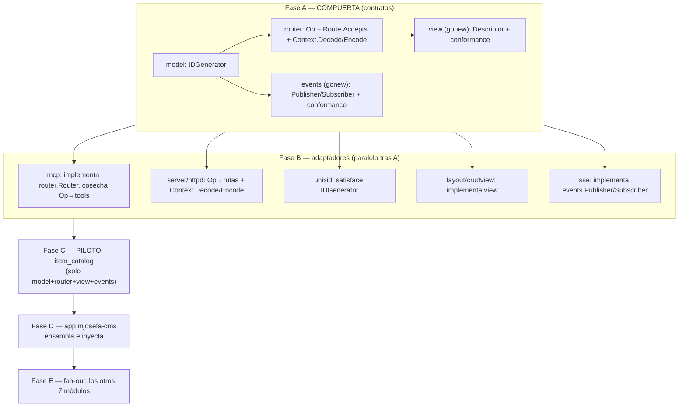

# MASTER PLAN — Módulos reutilizables: acoplados solo a contratos tipados

Hub de coordinación multi-repo. Cierra el acoplamiento que impide reutilizar y **testear** un
módulo de dominio: hoy un módulo (`veltylabs/modules/*`) depende de **implementaciones** de
transporte (`tinywasm/mcp`), de codificación (`tinywasm/json`) y de generación de id
(`tinywasm/unixid`), y **no declara su propia vista** (vive aguas abajo, en el app, acoplada a
`tinywasm/layout`). Un módulo así no es una pieza de lego: no se puede montar en otro transporte,
ni testear en su propio repo.

> Dispatch: 2026-07-15 · **Estado: 🟡 EN CURSO — Fase A (compuerta) parcial**
> Doctrina: [`CONSTRUCTION_HARNESS.md`](CONSTRUCTION_HARNESS.md).
> Antecedentes: [`ROUTER_CONFORMANCE_MASTER_PLAN.md`](ROUTER_CONFORMANCE_MASTER_PLAN.md)
> (el patrón `conformance` que aquí replicamos para la UI),
> [`CRUD_HARNESS_MASTER_PLAN.md`](CRUD_HARNESS_MASTER_PLAN.md) (la vista CRUD via `layout`).

---

## 0. Estado de ejecución (se actualiza al despachar/publicar cada pieza)

Las piezas de la **compuerta** (Fase A) que definen contrato se implementaron y publicaron
**directamente** (sin pasar por `docs/PLAN.md` + CodeJob) — son cambios pequeños, propios de
esta sesión, y desbloquean todo lo demás. Los adaptadores (Fase B) y los módulos (Fases C–E) **sí**
se despachan vía CodeJob cuando les toque, como dice §8.

| Pieza | Repo | Estado | Publicado |
|---|---|---|---|
| A1 — `model.IDGenerator` | `tinywasm/model` | ✅ hecho | `v0.0.15` |
| A2 — `router.Op` / `Route.Accepts` / `Context.Decode`+`Encode` + `router/conformance` | `tinywasm/router` | ✅ hecho | `v0.1.12` (`docs/PLAN.md` de conformance, ya implementado, se retiró — su contenido pasó a `README.md`) |
| A4 — `events.Publisher`/`Subscriber`/`Broker` + `events/mock` + `events/conformance` | `tinywasm/events` (**repo nuevo**, creado con `gonew`) | ✅ hecho | `v0.0.2` |
| A3 — `view.Descriptor`/`Presenter` + `view/conformance` | `tinywasm/view` (**repo nuevo**, creado con `gonew`) | 🟡 repo creado, **sin implementar** (solo el scaffold de `gonew`) | no publicado |
| B (adaptadores: mcp, server/httpd, unixid, layout/crudview, sse) | — | ☐ no iniciado | — |
| C (piloto `item_catalog`) | `veltylabs/item_catalog` | ☐ no iniciado — su `docs/PLAN.md` actual (Kind API + agreements) **sigue vigente y sin tocar**; falta la rectificación de esta ola | — |
| D (`mjosefa-cms`) | `veltylabs/mjosefa-cms` | ☐ no iniciado — su `docs/PLAN.md` actual (swap a item_catalog) **sigue vigente y sin tocar** | — |
| E (7 módulos restantes) | — | ☐ no iniciado | — |

**⚠️ Rotura ya en curso, esperada (ver §8):** publicar A2 (`router` v0.1.12) rompió la compilación de
`server`, `goflare`, `mjosefa-cms` (`app`), `client`, `devbrowser`, y los tests de `user` — todos
implementan `router.Router`/`Context`/`Route` y les faltan los métodos nuevos. **No se tocan
todavía**: es trabajo de Fase B, a despachar. Mientras tanto esos repos NO compilan contra
`router@v0.1.12`.

**Siguiente paso concreto:** terminar A3 (`tinywasm/view`) — escribir `Descriptor`/`Presenter`,
`view/conformance` (reutilizando `router/mock.Caller`, ya existente — no reinventar), un test
consumer-shaped, y publicar. Con eso cierra la Fase A completa.

---

## 1. El síntoma (medido)

En `veltylabs/modules/*`, código no-test:

| Acoplamiento | Import | Archivos |
|---|---|---|
| Transporte | `tinywasm/mcp` (`mcp.Tool/Request/Result`, `req.Params.Arguments`, `Execute`) | 5 |
| Codificación | `tinywasm/json` (`json.Encode/Decode`) | 4 |
| Generación de id | `tinywasm/unixid` (`NewUnixID`, `GetNewID`) | 8 |
| Pub/sub | **cada módulo redeclara su propio `EventPublisher`**, con `payload any` y firmas que **no coinciden** entre sí (`item_catalog`/`clinical_encounter` vs `appointment_booking`) | 3+ definiciones divergentes |

Y la **vista** de cada módulo no existe en el módulo: se escribe en `mjosefa-cms/modules/x/view.go`
importando `tinywasm/layout`. Consecuencia directa: **el módulo no puede testear su propia vista**
— el hueco se descubre en el app, donde el agente no puede publicar aguas arriba y solo puede
parchear. Es exactamente el bucle que el arnés existe para romper.

## 2. El problema de fondo

**Reutilizable = acoplado solo a contratos, nunca a implementaciones.** Un módulo debe depender de
*qué* necesita (un generador de id, un transporte, un codec, un renderer), nombrado como **interfaz
tipada**, y recibir el *cómo* por inyección en la raíz de composición. Hoy nombra el *cómo*
directamente (`unixid`, `mcp`, `json`, `layout`), así que arrastra esas librerías a todo consumidor
y no puede sustituirlas.

Esto viola dos puntos del arnés:

- **"Lego pieces, never forks."** Una pieza de una responsabilidad, expuesta como contrato tipado;
  los consumidores ensamblan. Un módulo que importa `mcp` fusiona "lógica de dominio" con "protocolo
  de wire" — no es una pieza.
- **"Una API no está publicada hasta que un test con forma de consumidor, DENTRO de la librería, la
  prueba."** La vista del módulo no tiene ese test porque no vive en el módulo.

## 3. La solución — cinco contratos, cero implementaciones en el módulo

Un módulo dependerá **solo** de `tinywasm/model` + `tinywasm/router` + `tinywasm/view` +
`tinywasm/events`. Todo lo demás (el generador de id, el transporte, el codec, el renderer, el
broker) se inyecta.

### 3.1 Codec — YA está en `model` (no se crea nada)

`model` ya es dueño del contrato de codificación: `FieldWriter`/`FieldReader`/`Encodable`/
`Decodable`. `tinywasm/json` es **una** implementación (bytes); `jsvalue` es otra. **El módulo deja
de importar `json`**: sus handlers reciben modelos ya decodificados y devuelven `model.Encodable`;
el codec lo aplica el adaptador de transporte, no el módulo.

### 3.2 Generación de id — NUEVO contrato mínimo en `model`

```go
// tinywasm/model
type IDGenerator interface { NewID() string }
```

`unixid` lo satisface (añade `NewID()` junto a su `GetNewID()` actual). El módulo recibe un
`model.IDGenerator` por `Deps` y **deja de importar `unixid`**.

### 3.3 Transporte — EXTENDER el `router.APIModule` que YA existe (no un contrato paralelo)

El módulo ya tiene contrato proveedor: `router.APIModule { ModelName(); MountAPI(Router) }`. **No se
crea un trío nuevo** (`Operation`/`OpProvider`/`OpContext`) — sería una segunda forma de publicar API
junto a `APIModule`, contra "una forma de hacer cada cosa". En su lugar se **añaden tres piezas
mínimas** al contrato existente para que **un solo `APIModule` sirva a mcp y a httpd**:

```go
// tinywasm/router (adiciones; el spec completo va en su PLAN)

// 1) Registro NEUTRAL por nombre de op, simétrico a Caller.Call(name, …).
//    httpd lo mapea a POST {prefix}/{name}; mcp lo cosecha como un tool llamado name.
type Router interface {
    // …lo existente (Get/Post/…, PublicAsset, Use, Routes)…
    Op(name string, h HandlerFunc) Route
}

// 2) El schema tipado de argumentos, hoy atrapado en mcp.Tool.Args, movido al contrato neutral.
type Route interface {
    // …Requires/Authenticated/Public…
    Accepts(args model.Fielder) Route // mcp lo publica en tools/list; httpd valida con él
}

// 3) Codec TIPADO en el borde — el handler no importa json.
type Context interface {
    // …Body()/Write() siguen intactos para rutas binarias…
    Decode(into model.Decodable) error // usa el codec del transporte (json / jsvalue)
    Encode(v model.Encodable) error    // idem, al escribir la respuesta
}
```

Con esto el módulo escribe su `MountAPI` una vez:

```go
func (m *Module) MountAPI(r router.Router) {
    r.Op("upsert_catalog_item", m.upsert).Requires("catalog_item", model.Create).Accepts(&CatalogItem{})
}
func (m *Module) upsert(ctx router.Context) {
    var in CatalogItem
    if err := ctx.Decode(&in); err != nil { /* … */ }
    // … lógica de dominio, id inyectado …
    _ = ctx.Encode(&out)
}
```

- **httpd** ya es un `Router` real: cada `Op` es una ruta con su `.Requires`.
- **mcp** implementa un `router.Router` que, al recibir `MountAPI`, **cosecha cada `Op` como un tool**
  (nombre, schema desde `Accepts`, RBAC desde `Requires`, `Execute` que envuelve el handler con un
  `Context` respaldado por mcp). mcp sigue montando su único `/mcp` sobre el server real.
- El módulo importa **solo `router` + `model`** — ni `mcp` ni `json`.

**Coste asumido:** `router.Context` —hoy byte-only— crece con `Decode/Encode`, y todo implementador
(`httpd`, `edge`, `mock`, `sse`) debe añadirlos y `router/conformance` cubrirlos. A cambio: un único
contrato proveedor, y el módulo libre de transporte **y** de codec.

### 3.4 UI — NUEVA librería `tinywasm/view` (gonew) + `view/conformance`

`gonew` crea `github.com/tinywasm/view` (dueño tinywasm). Declara el **descriptor de vista neutral**
— registro (`model.Model`) + ops (nombres, resueltas contra un `router.Caller`) + proyección
registro→ítem-de-lista (label/description) + título/placeholder — **sin** nombrar ninguna tecnología
de UI. Y expone `view/conformance` (réplica exacta de `router/conformance`): un cuerpo de tests que
cualquier renderer prueba contra sí mismo (la lista pinta ítems; seleccionar llena el form; guardar/
eliminar disparan la op correcta vía un `Caller` falso).

- **El MÓDULO declara su vista** (`View() view.Descriptor`), importando solo `view`+`model`+`router`.
- `tinywasm/layout/crudview` pasa a ser **un adaptador** que consume `view.Descriptor` y pasa
  `view/conformance`. Mañana un renderer distinto (nativo, HTMX) hace lo mismo sin tocar módulos.

**¿Por qué una librería nueva y no `model`/`router`/`layout`?** Porque la presentación es otra
responsabilidad (lego propio); debe ser tech-agnóstica para que el módulo no se acople a `layout`;
necesita su conformance ejecutable (el test que hoy falta); y `model` (codec puro) / `router`
(transporte) no son el hogar de un "label de tarjeta".

### 3.5 Pub/sub — NUEVA librería `tinywasm/events` (gonew): contrato tipado, inyectado

Hoy **cada módulo redeclara su propio `EventPublisher`, y ni siquiera coinciden**: `item_catalog` y
`clinical_encounter` usan `Publish(event string, payload any) error`; `appointment_booking` usa
`Publish(ctx, event string, payload any) error`. Todos con `payload any` (hueco genérico) y sin
contrato de suscripción. `tinywasm/sse` ya existe pero es **una implementación** (push al browser
sobre `router.Streamer`), no el contrato.

`gonew` crea `github.com/tinywasm/events` con el contrato tipado + su `events/conformance`:

```go
// tinywasm/events (boceto; el spec completo va en su PLAN)
type Event struct {
    Topic   string          // p.ej. "catalog.item.created" — constante que exporta el publicador
    Payload model.Encodable // TIPADO, cero `any`
}
type Publisher interface {
    Publish(e Event) // fire-and-forget
}
type Subscriber interface {
    Subscribe(topic string, h func(payload model.FieldReader)) // el broker decodifica con su codec
}
```

- El módulo recibe un `events.Publisher` por `Deps` (como el `IDGenerator`) y **borra su
  `EventPublisher` propio**. Publica `events.Event{Topic: OpItemCreated, Payload: &item}`.
- El app cablea el broker concreto: **in-proc** para módulo↔módulo en el mismo binario, y `sse` para
  push al cliente. `sse` pasa a **implementar** `events.Publisher`/`Subscriber` (deja de ser un
  mecanismo suelto).
- Un módulo que consume eventos ajenos declara sus `Subscribe`; el topic es una constante exportada
  por el módulo publicador (igual que los nombres de op).

**¿Por qué lib nueva y no `router`/`sse`?** `router` es request/response (una respuesta por llamada);
pub/sub es fan-out (N suscriptores, sin respuesta) — otra responsabilidad. Y `sse` es **una**
implementación (browser); meter el contrato ahí lo acoplaría a esa impl. `events` es el contrato;
`sse` y el broker in-proc son impls.

## 4. Lo que NO hacemos (y por qué)

- ❌ **Envolver `mcp`/`unixid`/`layout` en el módulo** para "adaptarlos". Un wrapper que parcha es un
  fork con nombre amable. El contrato se arregla aguas arriba y el módulo lo consume.
- ❌ **Declarar interfaces locales** que intersecten tipos de `model`/`router`. Si falta un contrato
  en una frontera, el defecto está aguas arriba — se nombra ahí.
- ❌ **Dejar la vista en el app.** Es justo lo que impide testear el módulo. La vista se declara en el
  módulo; el app solo acopla el renderer concreto.
- ❌ **Meter la vista en `layout`** como contrato. Acoplaría los módulos a esa tech de UI.

## 5. Grafo de dependencias



- **A es la compuerta.** `model` primero (todos lo importan); luego `router` y `events` (importan
  `model`); luego `view` (importa `model`+`router`).
- **B corre en paralelo** tras A (repos distintos).
- **C (piloto) valida el patrón end-to-end en UN módulo** antes de tocar los demás. Si un contrato
  está mal, se descubre en 1, no en 8.
- **D** integra en el app (una sola pasada; doctrina: el app siempre al final).
- **E** replica el patrón a los 7 restantes solo cuando el piloto está en verde.

## 6. Planes por librería

Cross-repo → los enlaces son URLs de GitHub (el agente ejecutor solo tiene su repo). Cada plan es
autocontenido; el contrato completo va inline en él.

| Fase | Librería | Plan | ¿Rompe API? | Estado |
|------|----------|------|-------------|--------|
| **A1 (compuerta)** | `tinywasm/model` | Implementado directo (sin PLAN.md) — `IDGenerator{NewID() string}` en `interface.go` | No (aditivo) | ✅ `v0.0.15` |
| **A2 (compuerta)** | `tinywasm/router` | Implementado directo — `Router.Op`, `Route.Accepts`, `Context.Decode/Encode` + 4 cláusulas nuevas en `router/conformance` + `router/mock` al día. `docs/PLAN.md` (conformance) retirado: su contenido ya estaba implementado y pasó a `README.md` | No en consumidores; **sí en implementadores** (métodos nuevos) | ✅ `v0.1.12` — ⚠️ rompe `server`/`goflare`/`app`/`client`/`devbrowser`/`user` hasta Fase B |
| **A3 (compuerta)** | `tinywasm/view` | **Repo creado con `gonew`** (remoto + local, `github.com/tinywasm/view`) — `Descriptor`/`Presenter`/`view/conformance` **sin escribir todavía**, solo el scaffold | N/A (nuevo) | 🟡 repo vacío, no publicado |
| **A4 (compuerta)** | `tinywasm/events` | Implementado directo — `Publisher`/`Subscriber`/`Broker`/`Event`, `events/mock.Broker` (referencia), `events/conformance` (5 cláusulas), test consumer-shaped | N/A (nuevo) | ✅ `v0.0.2` |
| **B1** | `tinywasm/mcp` | `mcp/docs/PLAN.md` (nuevo) — implementar un `router.Router` que cosecha `Op`→tools (schema desde `Accepts`); `NewCaller` intacto | **Sí** — módulos dejan de usar `mcp.Tool` | ☐ |
| **B2** | `tinywasm/server` | `server/docs/PLAN.md` (nuevo) — httpd implementa `Op` (POST {prefix}/{name}) + `Context.Decode/Encode` | No en consumidores; métodos nuevos | ☐ |
| **B3** | `tinywasm/unixid` | `unixid/docs/PLAN.md` (nuevo) — satisface `model.IDGenerator` (`NewID()`) | No (aditivo) | ☐ |
| **B4** | `tinywasm/layout` | `layout/docs/PLAN.md` (nuevo) — `crudview` consume `view.Descriptor` y pasa `view/conformance` | **Sí** — `crudview.Config`→`view.Descriptor` | ☐ |
| **B5** | `tinywasm/sse` | `sse/docs/PLAN.md` (nuevo) — implementa `events.Publisher`/`Subscriber` (impl de push al browser) | No (aditivo) | ☐ |
| **C (piloto)** | `veltylabs/item_catalog` | `item_catalog/docs/PLAN.md` (**rectificar** el actual) — `MountAPI` con `r.Op(...).Requires().Accepts()`; `View() view.Descriptor`; inyecta `IDGenerator` y `events.Publisher`; borra su `EventPublisher`; tests `view/conformance`; **sin** mcp/json/unixid | **Sí** | ☐ |
| **D** | `veltylabs/mjosefa-cms` | `mjosefa-cms/docs/PLAN.md` (**rectificar**) — ensambla: inyecta unixid, transporte mcp (cosecha `MountAPI`), renderer layout, broker in-proc + sse | Consumidor | ☐ |
| **E** | `agent_switch`, `appointment_booking`, `business_hours`, `clinical_encounter`, `provider_payouts`, `work_schedule` (+ `item_catalog` ya hecho) | **rectificar** cada `docs/PLAN.md` al patrón del piloto | **Sí** c/u | ☐ |

## 7. Criterio de aceptación del piloto (Fase C, la validación del patrón)

Antes de disparar la Fase E, en `veltylabs/item_catalog`:

- `grep -rn "tinywasm/mcp\|tinywasm/json\|tinywasm/unixid" .` (código no-test) **vacío**. Los únicos
  imports tinywasm de dominio son `model`, `router`, `view`, `events`.
- El módulo implementa `router.APIModule` (`MountAPI` con `r.Op(...).Requires().Accepts()`) y
  `View() view.Descriptor`. **No** declara ningún `EventPublisher` propio: usa `events.Publisher`.
- El id y el publicador entran por `Deps{ IDs model.IDGenerator; Events events.Publisher }` — el
  módulo nunca construye un generador ni un broker.
- Un test **en el repo del módulo** ejerce `view/conformance` con un `router.Caller` falso: prueba
  lista/seleccionar/guardar/eliminar sin app, sin navegador real (target no-wasm) y con DOM real
  (target wasm). Y un test ejerce `MountAPI` contra `router/mock` ( op enrutada + RBAC), y la
  publicación de eventos contra un `events.Publisher` falso.
- `gotest ./...` verde en ambos targets.

Si esos tests son incómodos de escribir, el contrato (Fase A/B) tiene un defecto: **se corrige aguas
arriba y se vuelve a publicar**, nunca se parcha en el módulo.

## 8. ⚠️ Compuertas y advertencias

- **A1 primero; A2/A3/A4 después** (import chain `model ← router`, `model ← events`,
  `model`+`router ← view`). A3 y A4 pueden ir en paralelo tras A1/A2.
- **B1 (`mcp`) y B4 (`layout`) rompen API.** Sus consumidores actuales (`mjosefa-cms`, tests) verán
  rojo hasta la Fase D. Es el hallazgo, no una regresión: prueba que el acoplamiento existía.
- **A2 toca `router.Context`/`Router`/`Route` (interfaces):** añadir métodos **rompe a los
  implementadores** (`httpd`, `edge`, `mock`, `sse`), que deben implementarlos, y `router/conformance`
  debe cubrirlos. No rompe a los consumidores (los módulos solo ganan capacidades).
- **`router` ya tiene un `docs/PLAN.md` pendiente** (conformance, "implementada sin publicar"). El
  trabajo de `Op`/`Accepts`/`Decode`/`Encode` va como `PLAN_OPERATION.md` encolado, no lo sobrescribe.
- **Publicación:** doctrina de dispatch — cada repo se publica cuando su plan cierra; el app
  (`mjosefa-cms`) siempre al final, en una sola pasada de integración. No tocar repos ya publicados
  sin pedirlo.
- **No hay carpetas `internal/`** en ninguna fase: son señal de fork en vez de contribución aguas
  arriba.
