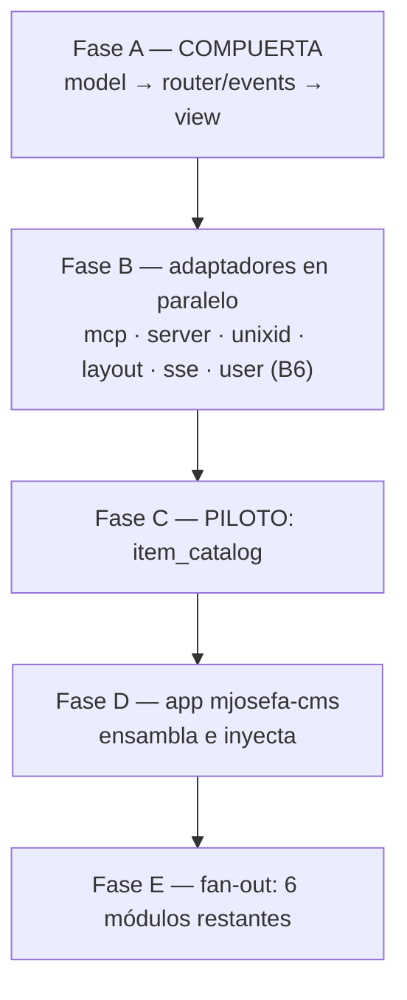

# MASTER PLAN — Módulos reutilizables: acoplados solo a contratos tipados

Hub de coordinación multi-repo. Cierra el acoplamiento que impedía reutilizar y **testear** un
módulo de dominio (`veltylabs/modules/*`): dependían de implementaciones concretas (`mcp`, `json`,
`unixid`) y no declaraban su propia vista. El detalle normativo (whitelist de imports, límite con
la stdlib, no-map/no-reflect, testing contra `storage/mem`) vive en **un solo lugar**:
[`veltylabs/modules/AGENTS.md`](https://github.com/veltylabs/modules/blob/main/AGENTS.md) (canónico,
copiado verbatim en cada módulo). Este documento solo coordina: estado, orden y decisiones cerradas.

> Dispatch: 2026-07-15 · Última rectificación: 2026-07-18
> ([auditoría](AUDITORIA_ARQUITECTURA_MJOSEFA_CMS.md)). **El estado por pieza es la columna
> "Estado" de §1 — única fuente; no se duplica aquí.**
> Doctrina: [`CONSTRUCTION_HARNESS.md`](CONSTRUCTION_HARNESS.md) · Antecedentes:
> [`ROUTER_CONFORMANCE_MASTER_PLAN.md`](ROUTER_CONFORMANCE_MASTER_PLAN.md),
> [`CRUD_HARNESS_MASTER_PLAN.md`](CRUD_HARNESS_MASTER_PLAN.md).

---

## 1. Estado por pieza

Fase A (compuerta) se implementó directo, sin CodeJob. Fases B–E se despachan vía CodeJob, un repo
por plan, cada plan autocontenido (enlaces cross-repo = URLs de GitHub). El "qué cambia" completo
vive en el `docs/PLAN.md` de cada repo — aquí solo la línea de identidad.

| Fase | Repo | Qué | ¿Rompe API? | Estado |
|---|---|---|---|---|
| A1 | `model` | `IDGenerator{NewID()}` | No | ✅ `v0.0.15` |
| A2 | `router` | 3 olas: `Route.Accepts` + `Context.Decode/Encode` (`v0.1.12`), `Caller.Call` tipado (`v0.1.13`), `OpRegistry`/`OpModule` fuera de la interfaz gorda (`v0.1.14`) | Sí, en implementadores | ✅ `v0.1.14` |
| A3 | `view` (nuevo) | `Presenter` + `view.New(...)` + `mock` + `conformance` | N/A | ✅ `v0.1.0` |
| A4 | `events` (nuevo) | `Publisher`/`Subscriber`/`Broker`/`Event` + `mock` + `conformance` | N/A | ✅ `v0.0.2` |
| B1 | `mcp` | [`PLAN`](https://github.com/tinywasm/mcp/blob/main/docs/PLAN.md) — `HarvestOps(...OpModule)`, `Caller` tipado | **Sí**: `Tools()` → `MountOps` | ✅ `v0.2.0` |
| B2 | `server` | httpd: `Context.Decode/Encode`; se cae la proyección `/op` | No en consumidores | ✅ `v0.2.32` |
| B3 | `unixid` | `GetNewID` → `NewID()`, `SetNewID(*string)` — satisface `IDGenerator` | Sí (renombre) | ✅ `v0.2.24` |
| B4 | `layout` | `crudview` = solo renderer: `Config{ParentID, Presenter}` | **Sí** | ✅ `v0.0.14` |
| B5 | `sse` | Servidor: `sse.Publisher` (adapta a `events.Publisher`) ✅ `v0.1.1`. Resta: `events.Subscriber` wasm sobre `SSEClient.OnMessage`, `events.Fanout` (aditivo en `events`), y montaje seguro en el app (canal desde `ctx.UserID()`, jamás elegido por el cliente — auditoría §4) | No (aditivo) | 🟡 mitad servidor publicada; resto sin plan |
| B6a | `user` | Fix del drift `orm v0.11` (mismo que C): `ddl.Sync`+`TopologicalSort`, `ErrNotFound`, `ddlc→model.FieldExt` (PR #18, con corrección de review: bump `unixid v0.2.24`, no revert a `GetNewID`). Origen: `mjosefa-cms` lo parcheaba con forks locales (`local_orm` con `CreateTable` no-op que silenciaba el esquema de auth) | No | ✅ **publicado `v0.0.37`** (2026-07-18) — `mjosefa-cms` ya puede borrar sus forks/`replace` |
| B6b | `user` | [`user/docs/PLAN.md`](https://github.com/tinywasm/user/blob/main/docs/PLAN.md) (promovido desde la cola al cerrar B6a) — alineación al patrón: `Config.IDs`/`Config.Events`, `TopicSecurity`, `MountOps` (op `me` + ops CRUD `list_users`/`upsert_user`/`delete_user` gated `Requires("users",…)`), codec vía `Context`, **y vista admin de usuarios `user.NewView(caller)`** (requerida por `mjosefa-cms`); excepciones documentadas (`MountAPI`, `jwt`/crypto, `fetch`+`json` solo `oauth.go`) | **Sí** (`v0.1.0`) | ☐ **listo para dispatch** (gate B6a cumplido 2026-07-18) |
| C | `item_catalog` (piloto) | `OpModule` + `view.New` + `Deps{IDs, Publisher}`; validó el patrón end-to-end | **Sí** | ✅ mergeado (`c6f90d0`) · 🔴 roto por el drift `orm v0.11` (fix en su `docs/PLAN.md`) · ⚠️ **nuevo drift detectado 2026-07-18**: `view v0.1.2` rompió `view.New` (sin `project` posicional ni `WithFill`; proyección vía `view.Itemizer` en el registro; `Save/Delete` → `Saver`/`Deleter`) — `item_catalog v0.3.0` usa la API vieja y romperá cuando un consumidor resuelva `view ≥ v0.1.2` (B6b/`user v0.1.0` la requiere). Añadir la migración al mismo fix pendiente de su `docs/PLAN.md` |
| D | `mjosefa-cms` | Composition root: cosecha `HarvestOps`, inyecta `unixid`/`httpd`/`crudview`/broker | Consumidor | 🟡 PR #3 en corrección; B6a publicada → borrar `replace`/forks y pinear `user v0.0.37` YA |
| E | `agent_switch`, `appointment_booking`, `business_hours`, `clinical_encounter`, `provider_payouts`, `work_schedule` | Réplica del patrón validado por C | **Sí** c/u | 🟡 docs en rectificación; código **gated** hasta C+D verdes (§4) |

## 2. El patrón en una frase (+ la única aclaración que no vive en AGENTS.md)

Un módulo importa **contratos y puertos** — `model`, `router`, `view`, `events`, más `orm`/
`storage`/`ddl` para persistencia — y recibe inyectado todo lo concreto (generador de id,
transporte, codec, renderer, broker, backend de storage). Whitelist completa y justificación
puerto-vs-implementación: `AGENTS.md` canónico.

**Historia que explica dos roturas (C y B6a):** `orm.DB.CreateTable` fue removido — el schema
runtime se extrajo al sibling `tinywasm/ddl`. `ddl.Compiler` es capacidad opcional del backend
(SQL sí; `storage/mem` no — crea tablas perezosamente): el módulo hace *type assertion* sobre
`db.RawConn()` y, sin la capacidad, migrar es un no-op **legítimo** (solo en tests/mem; un no-op
*hardcodeado* contra un backend SQL es el anti-patrón que la auditoría encontró en `mjosefa-cms`).

## 3. Decisiones cerradas (no re-litigar)

- **Aguas arriba, nunca fork local.** Ni wrapper adaptador, ni `internal/`, ni `replace` a carpeta
  local, ni interfaz local que duplique un contrato: el defecto se corrige en el repo dueño y se
  republica. Violaciones vivas: `work_schedule` (`replace` a `mcp`, se cierra en su Fase E) y los
  forks de `mjosefa-cms` (se cierran con B6a).
- **La vista se declara en el módulo** (`view.Presenter`); el app solo acopla el renderer. `layout`
  nunca es contrato.
- **Ni `mcpd` ni partir `mcp`**: `mcp` ya depende solo de `router`; un paquete "mcp-contrato" no
  tendría consumidor.
- **El app integra al final, en una sola pasada** — por eso B1/B4 publicados dejaron `mjosefa-cms`
  en rojo hasta Fase D: es el hallazgo del acoplamiento, no una regresión.
- **`AGENTS.md` canónico por módulo** (2026-07-17): vive en `veltylabs/modules/AGENTS.md`, cada
  módulo lo copia verbatim y solo llena "Domain-specific notes"; los planes lo referencian en vez
  de re-inlinear contratos.
- **`clinical_encounterOld` no se toca** (legado sin importadores, fuera de alcance).

## 4. Grafo y gate de Fase E

**Gate:** Fase E no despacha código hasta que C y D estén verdes. Criterio de verde para C (y para
cada módulo de E al replicar):

- Blacklist limpia en todo el repo, tests incluidos: `grep -rn "tinywasm/mcp\|tinywasm/json\|
  tinywasm/unixid\|tinywasm/sqlite\|tinywasm/sqlt\|tinywasm/postgres\|tinywasm/layout" .` vacío
  (tests con `storage/mem`, nunca un driver).
- `var _ router.OpModule = (*Module)(nil)` compila; vista vía `view.New(...)`; `Deps{IDs,
  Publisher}` inyectados; schema propio vía `ddl` (§2).
- Tests en el repo del módulo: `Presenter` con caller falso (ambos targets), `MountOps` contra
  `router/mock` (op + RBAC), eventos contra publisher falso. `gotest ./...` verde stdlib + wasm.
- Si un test del patrón resulta incómodo de escribir, el defecto es del contrato (Fase A/B): se
  corrige aguas arriba y se republica — nunca se parcha en el módulo.
