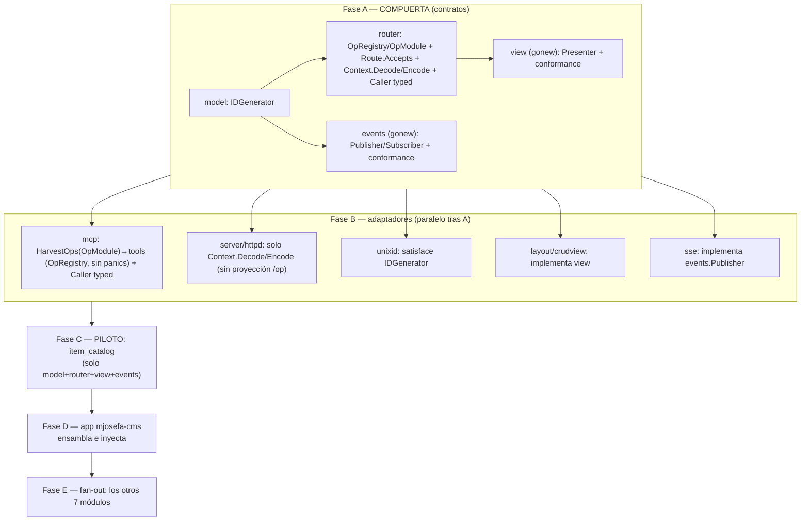

# MASTER PLAN — Módulos reutilizables: acoplados solo a contratos tipados

Hub de coordinación multi-repo. Cierra el acoplamiento que impide reutilizar y **testear** un
módulo de dominio: hoy un módulo (`veltylabs/modules/*`) depende de **implementaciones** de
transporte (`tinywasm/mcp`), de codificación (`tinywasm/json`) y de generación de id
(`tinywasm/unixid`), y **no declara su propia vista** (vive aguas abajo, en el app, acoplada a
`tinywasm/layout`). Un módulo así no es una pieza de lego: no se puede montar en otro transporte,
ni testear en su propio repo.

> Dispatch: 2026-07-15 · **Estado: 🟢 Fase A (compuerta) COMPLETA — Fase B en curso (3/5: mcp, server, layout ✅; unixid, sse pendientes)**
> Doctrina: [`CONSTRUCTION_HARNESS.md`](CONSTRUCTION_HARNESS.md).
> Antecedentes: [`ROUTER_CONFORMANCE_MASTER_PLAN.md`](ROUTER_CONFORMANCE_MASTER_PLAN.md)
> (el patrón `conformance` que aquí replicamos para la UI),
> [`CRUD_HARNESS_MASTER_PLAN.md`](CRUD_HARNESS_MASTER_PLAN.md) (la vista CRUD via `layout`).

---

## 1. Estado y plan por pieza

Las piezas de la **compuerta** (Fase A) definen contrato y se implementaron/publicaron
**directamente** (sin `docs/PLAN.md` + CodeJob) — cambios pequeños que desbloquean todo lo demás.
Los adaptadores (Fase B) y los módulos (Fases C–E) **sí** se despachan vía CodeJob, uno por repo
(§6). Cross-repo → los enlaces de plan son URLs de GitHub (el agente ejecutor solo tiene su repo);
cada plan es autocontenido, con el contrato completo inline.

| Fase | Repo | Qué cambia / Plan | ¿Rompe API? | Estado |
|---|---|---|---|---|
| A1 | `tinywasm/model` | Implementado directo — `IDGenerator{NewID() string}` en `interface.go` | No (aditivo) | ✅ `v0.0.15` |
| A2 | `tinywasm/router` | Implementado directo — `Route.Accepts`, `Context.Decode/Encode` + 4 cláusulas nuevas en `router/conformance` + `router/mock` al día. Su antiguo `docs/PLAN.md` (conformance) se retiró: contenido ya implementado, pasó a `README.md` | No en consumidores; **sí en implementadores** (métodos nuevos) | ✅ `v0.1.12` |
| A2b | `tinywasm/router` | Implementado directo — `Caller.Call` gana un destino tipado (`into model.Decodable`), simétrico a `Context.Decode`. No estaba en el boceto original — lo exigió construir `view` sin `json` | Rompe implementadores de `Caller` (`mcp.NewCaller`) y llamantes con la firma vieja de 3 argumentos | ✅ `v0.1.13` |
| A2c | `tinywasm/router` | Implementado directo — `Op` **sale** de la interfaz gorda `Router` y pasa a `router.OpRegistry` (interfaz propia, un método); nace `router.OpModule{ModelName(); MountOps(OpRegistry)}`. Motivo: obligaba a un transporte que solo cosecha operaciones (mcp) a fingir ser un router HTTP (`Get/Post` con `panic`). `router/mock`+`conformance`+`README` al día | **Sí en implementadores** que hubieran añadido `Op` a `Router` (solo `mock`, ningún httpd) | ✅ `v0.1.14`, consumido en verde por B1/B2/B4 |
| A3 | `tinywasm/view` (**repo nuevo**, `gonew`) | Implementado y publicado — `view.New(caller, record, listOp, newList, project, opts...)` + `Presenter` + `view/mock` + `view/conformance`. Forma final distinta del boceto original (no existe un tipo `Descriptor`) | N/A (nuevo) | ✅ `v0.1.0` |
| A4 | `tinywasm/events` (**repo nuevo**, `gonew`) | Implementado directo — `Publisher`/`Subscriber`/`Broker`/`Event`, `events/mock.Broker`, `events/conformance` (5 cláusulas), test consumer-shaped | N/A (nuevo) | ✅ `v0.0.2` |
| B1 | `tinywasm/mcp` | [`mcp/docs/PLAN.md`](https://github.com/tinywasm/mcp/blob/main/docs/PLAN.md) — bump a `router@v0.1.14`; `HarvestOps(...OpModule) ToolProvider` con un `opRegistry` que implementa `router.OpRegistry` (un método, sin panics) + `opContext` (bridge `router.Context`↔mcp); `mcpCaller.Call` migra a la firma tipada; `NewCaller` intacto. Sin `mcpd` | **Sí** — módulos dejan de implementar `Tools() []mcp.Tool` y pasan a `MountOps` | ✅ despachado y verificado, `v0.2.0` |
| B2 | `tinywasm/server` | `server/docs/PLAN.md` — bump a `router@v0.1.14`; httpd añade **solo** `Context.Decode/Encode` a su `httpContext`. Se cae la proyección `/op` (mcp es el único transporte de ops) | No en consumidores; método nuevo en context | ✅ despachado y verificado, `v0.2.32` |
| B3 | `tinywasm/unixid` | [`unixid/docs/PLAN.md`](https://github.com/tinywasm/unixid/blob/main/docs/PLAN.md) — añade `NewID() string` junto al `NewID()` existente | No (aditivo, confirmado: cero imports de `model` necesarios, cero colisiones) | ☐ escrito, sin despachar |
| B4 | `tinywasm/layout` | `layout/docs/PLAN.md` — `crudview` deja de ser el motor CRUD y pasa a ser **solo el renderer**: `Config` pierde `ListOp`/`SaveOp`/`DeleteOp`/`Args`/`Decode`/`Fill`/`Caller`/`Record`, absorbidos por el `view.Presenter` que el módulo ya construye vía `view.New(...)`. Los tres call-sites de `Caller.Call` en `crudview` desaparecen (no se migran, se eliminan) | **Sí** — `crudview.Config` → `Config{ParentID, Presenter}` | ✅ despachado y verificado, `v0.0.14` |
| B5 | `tinywasm/sse` | `sse/docs/PLAN.md` — implementa `events.Publisher`/`Subscriber` (push al browser) | No (aditivo) | ☐ pendiente de investigación |
| C (piloto) | `veltylabs/item_catalog` | [`item_catalog/docs/PLAN.md`](https://github.com/veltylabs/item_catalog/blob/main/docs/PLAN.md) — implementa `router.OpModule` (`MountOps(OpRegistry)` con `r.Op(...).Requires().Accepts()`), las 11 ops existentes; vista via `view.New(...)`; inyecta `model.IDGenerator` y `events.Publisher` tipado (7 call sites migrados); borra `EventPublisher`+`UIAdapter`; sin mcp/json/unixid | **Sí** | 🟡 escrito, sin despachar |
| D | `veltylabs/mjosefa-cms` | `mjosefa-cms/docs/PLAN.md` (rectificar) — el composition root declara explícito qué `OpModule`s se cosechan: `mcp.HarvestOps(items…)`; inyecta `unixid` como `IDGenerator`, `httpd` como `Router` real bajo `mcp`, `layout/crudview` como renderer, broker `events` (in-proc + `sse`) | Consumidor | 🟡 plan rectificado, sin despachar |
| E | `agent_switch`, `appointment_booking`, `business_hours`, `clinical_encounter`, `provider_payouts`, `work_schedule` | **Gated** (§5): no se escriben planes individuales hasta que C+D cierren en verde — replican el patrón validado por el piloto | **Sí** c/u | ☐ no iniciado, intencional |

---

## 2. La solución — cinco contratos, cero implementaciones en el módulo

Un módulo dependerá **solo** de `tinywasm/model` + `tinywasm/router` + `tinywasm/view` +
`tinywasm/events`. Todo lo demás (el generador de id, el transporte, el codec, el renderer, el
broker) se inyecta.

## 3. Lo que NO hacemos (y por qué)

- ❌ **Envolver `mcp`/`unixid`/`layout` en el módulo** para "adaptarlos". Un wrapper que parcha es un
  fork con nombre amable. El contrato se arregla aguas arriba y el módulo lo consume.
- ❌ **Declarar interfaces locales** que intersecten tipos de `model`/`router`. Si falta un contrato
  en una frontera, el defecto está aguas arriba — se nombra ahí.
- ❌ **Dejar la vista en el app.** Es justo lo que impide testear el módulo. La vista se declara en el
  módulo; el app solo acopla el renderer concreto.
- ❌ **Meter la vista en `layout`** como contrato. Acoplaría los módulos a esa tech de UI.

## 4. Grafo de dependencias

- **A es la compuerta.** `model` primero (todos lo importan); luego `router` y `events` (importan
  `model`); luego `view` (importa `model`+`router`).
- **B corre en paralelo** tras A (repos distintos).
- **C (piloto) valida el patrón end-to-end en UN módulo** antes de tocar los demás. Si un contrato
  está mal, se descubre en 1, no en 8.
- **D** integra en el app (una sola pasada; doctrina: el app siempre al final).
- **E** replica el patrón a los 7 restantes solo cuando el piloto está en verde.

## 5. Criterio de aceptación del piloto (Fase C, la validación del patrón)

Antes de disparar la Fase E, en `veltylabs/item_catalog`:

- `grep -rn "tinywasm/mcp\|tinywasm/json\|tinywasm/unixid" .` (código no-test) **vacío**. Los únicos
  imports tinywasm de dominio son `model`, `router`, `view`, `events`.
- El módulo implementa `router.OpModule` (`MountOps(r router.OpRegistry)` con
  `r.Op(...).Requires().Accepts()`) — **no** `MountAPI(Router)` — y construye su vista con
  `view.New(caller, record, listOp, newList, project, opts...)` (no existe un tipo `Descriptor`).
  **No** declara ningún `EventPublisher` propio: usa `events.Publisher`. Compila
  `var _ router.OpModule = (*Module)(nil)`.
- El id y el publicador entran por `Deps{ IDs model.IDGenerator; Events events.Publisher }` — el
  módulo nunca construye un generador ni un broker.
- Un test **en el repo del módulo** ejerce el `view.Presenter` resultante con un `router.Caller`
  falso (o el `conformance.FakeCaller` de `view/conformance`, codec-free): prueba
  lista/seleccionar/guardar/eliminar sin app, sin navegador real (target no-wasm) y con DOM real
  (target wasm). Y un test ejerce `MountOps` contra `router/mock` (que satisface `OpRegistry`): op
  enrutada + RBAC, y la publicación de eventos contra un `events.Publisher` falso.
- `gotest ./...` verde en ambos targets.

Si esos tests son incómodos de escribir, el contrato (Fase A/B) tiene un defecto: **se corrige aguas
arriba y se vuelve a publicar**, nunca se parcha en el módulo.

## 6. ⚠️ Compuertas y advertencias

- **Orden ejecutado**: A1 → A2 (incluida A2b) → A4 → A3, todo publicado en ese orden (import chain
  `model ← router`, `model ← events`, `model`+`router ← view`; A3/A4 podían ir en paralelo tras
  A1/A2).
- **`router` rompió tres veces** (`v0.1.12`/`v0.1.13`/`v0.1.14`, detalle en la tabla §1) — cada ola la
  cierra un plan B distinto: B2 (`server/httpd`) absorbe `Context.Decode/Encode`; B1 (`mcp`) absorbe
  el `Caller` tipado y `HarvestOps`. `httpd`/`sse` nunca implementaron `Caller`, sin impacto ahí.
- **B1 (`mcp`, `v0.2.0`) y B4 (`layout`, `v0.0.14`) rompen API de sus consumidores actuales**
  (`mjosefa-cms`, sus tests). Ambos ya están publicados — `mjosefa-cms` verá rojo hasta la Fase D. Es
  el hallazgo, no una regresión: prueba que el acoplamiento existía.
- **Ni `mcpd` ni partir `mcp`**: `mcp` ya depende solo de la abstracción `router` (no importa
  `net/http`/`httpd`); el consumidor ya inyecta `httpd`. Un paquete "mcp-contrato" no tendría
  consumidor (los módulos usan `router`; el composition root usa el concreto). Se descartó.
- **Publicación:** doctrina de dispatch — cada repo se publica cuando su plan cierra; el app
  (`mjosefa-cms`) siempre al final, en una sola pasada de integración. No tocar repos ya publicados
  sin pedirlo. B1/B2/B4 ya están despachados, verificados y publicados; B3 (`unixid`) y B5 (`sse`)
  siguen escritos, sin despachar — requieren decisión explícita de dispatch.
- **No hay carpetas `internal/`** en ninguna fase: son señal de fork en vez de contribución aguas
  arriba.
