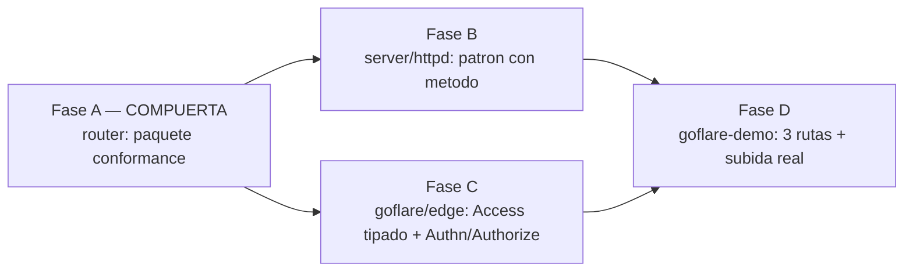

# MASTER PLAN — El contrato del router trae su propio arnés

Hub de coordinación multi-repo. Cierra el hueco que dejó abierto
`ROUTER_ADAPTER_MASTER_PLAN.md`: el contrato `tinywasm/router` se publicó como **interfaz**
(tipos), pero su **comportamiento** no quedó aterrizado en ningún sitio ejecutable. Dos
implementaciones lo interpretan distinto y **nada las obliga a coincidir**.

> Dispatch: 2026-07-13 · **Estado: ☐ PENDIENTE**
> Doctrina: `app/docs/CONSTRUCTION_HARNESS.md`.
> Antecedentes: `ROUTER_ADAPTER_MASTER_PLAN.md` (Fases 0–2), `AUTH_POLICY_MASTER_PLAN.md`
> (vocabulario RBAC tipado: `model.Access`, `model.Authorizer`).

---

## 1. Los síntomas

Los tres salieron el mismo día, al ejercitar `goflare-demo` — que existe justamente para eso:

1. **Una ruta con permisos en el borde es un 403 eterno.** `goflare/files` monta la subida
   como `Put(prefix, upload).Requires("files", "write")`. En `goflare/edge`, **no existe
   ninguna forma de establecer la identidad del llamante**: el gate RBAC se ejecuta *antes*
   de los middlewares, así que ni un middleware de autenticación llega a tiempo. Resultado:
   `PUT /api/files/` responde 403 siempre, para todo el mundo. La API de archivos —una de las
   tres que el demo debe demostrar— **es inservible en producción**.

2. **Tres métodos sobre el mismo path hacen panic en el servidor nativo.** `server/httpd`
   registra en el `ServeMux` **solo por path**, ignorando el método (el método lo filtra
   *dentro* del handler, devolviendo 405). Así que esto:

   ```go
   r.Post("/api/contacto", h).Public()
   r.Get("/api/contacto", l).Public()
   r.Options("/api/contacto", h).Public()
   ```

   registra el patrón `/api/contacto` tres veces y Go 1.22+ hace **panic por patrón
   duplicado** al arrancar. En `goflare/edge` esas mismas tres rutas conviven sin problema.

3. **El consumidor compensó con deuda.** `goflare-demo` había escrito una sola ruta
   `Handle("", "/api/contacto")` con un `if ctx.Method() == "GET"` a mano dentro. No era un
   descuido: era el rodeo al síntoma 2. El consumidor acabó re-implementando el enrutado por
   método que el contrato dice ofrecer.

## 2. El problema de fondo

**`router` es una interfaz, no un arnés.** Publica tipos; el comportamiento es folklore.

La evidencia: `router/tests/router_test.go` prueba el `mock` del propio paquete — la única
implementación **que nadie despliega**. Las dos que sí corren en producción no las prueba
nadie contra el contrato:

| | `server/httpd` (nativo) | `goflare/edge` (Cloudflare) |
|---|---|---|
| Modelo de acceso | `model.Access` tipado (Fase D de AUTH_POLICY) | `Public bool` + `Resource string` — a mano |
| ¿Quién es el llamante? | `Config.Authn` (middleware de identidad) | **no existe** |
| ¿Puede? | `Config.Authorize model.Authorizer` | **no existe**; comparación inline |
| Contradicción (guarded sin `Authorize`) | **falla al arrancar** (`enforce.go:17`) | pasa, y deniega en silencio |
| Mismo path, distinto método | **panic** | funciona |

Dos implementaciones del mismo contrato, divergentes en **todo lo que importa**. `edge` nunca
recibió el tratamiento que `httpd` sí recibió en la Fase 1, y no hubo nada que lo detectara.

Esto viola el arnés en dos puntos explícitos:

- **"Fallar en compilación, no en runtime; y lo que el compilador no atrape, que sea un aviso
  ruidoso, nunca un fallo silencioso."** Que dos implementaciones difieran **no lo puede
  atrapar el compilador**: ambas satisfacen la interfaz. Luego, por doctrina, tiene que
  convertirse en un fallo ruidoso — y hoy no hay nada que lo emita.
- **"Cerrado por defecto."** En `edge`, una ruta `Guarded` sin autorizador no falla al
  arrancar: **deniega en silencio, para siempre**. El default no es *deny*, es *ladrillo*.

## 3. La solución

**El contrato publica su propia suite de conformidad ejecutable.** Un paquete
`router/conformance` que expone `conformance.Run(t, factory)`: un cuerpo de tests que
**describe el comportamiento obligatorio** de cualquier `router.Router`. Cada implementación
—`httpd`, `edge`, y las que vengan— lo importa en su propio test y lo ejecuta contra sí
misma. Una implementación que no lo pase, no es una implementación.

Eso es lo que convierte los tipos en arnés: el comportamiento deja de ser folklore y pasa a
ser **una cosa que se ejecuta y se pone roja**.

No es una capa nueva ni un runtime nuevo. Es **el test que faltaba**, y vive donde vive el
contrato — no copiado en cada implementación, que es como divergen.

### Lo que NO hacemos (y por qué)

- ❌ **Revertir el demo al `Handle("", …)` con dispatch de método a mano.** Congela la deuda
  en el consumidor y deja el contrato roto para el siguiente que lo use.
- ❌ **Arreglar solo `httpd`, o solo `edge`.** Arregla el síntoma de hoy y no impide que
  vuelvan a divergir mañana. Sin conformidad no hay nada que lo detecte.
- ❌ **Dar a `files.Store` un `.Public()` para que la subida no exija permisos.** Convierte
  "abierto a todo el mundo" en un opt-out de una línea, contra *cerrado por defecto*. La
  subida **debe** exigir permiso; lo que falta es que el borde sepa quién llama.
- ❌ **Meter autenticación en `goflare` o en `router`.** La política es del consumidor
  (AUTH_POLICY). Las librerías aportan el **mecanismo** (`Authn`, `Authorize`); quién puede
  subir lo declara la app. En el demo eso son 15 líneas, y son **parte de la demostración**.

## 4. Grafo de dependencias



- **Fase A es la compuerta.** Publica el arnés. Nadie puede demostrar conformidad antes.
- **B y C corren en paralelo** tras A. Son repos distintos y no se tocan.
- **D es la aceptación**: `goflare-demo` es el único sitio donde se prueba que las tres APIs
  funcionan **en Cloudflare de verdad**. Sin B y C publicadas, no arranca.

## 5. Planes por librería

| Fase | Librería | Plan | ¿Rompe API? | Estado |
|------|----------|------|-------------|--------|
| **A (compuerta)** | `tinywasm/router` | [router/docs/PLAN.md](https://github.com/tinywasm/router/blob/main/docs/PLAN.md) | No en el contrato; **sí en `mock`** (ver abajo) | ✅ **implementada, sin publicar** |
| **B** | `tinywasm/server` | [server/docs/PLAN.md](https://github.com/tinywasm/server/blob/main/docs/PLAN.md) | No — arregla un panic | ☐ |
| **C** | `tinywasm/goflare` | [goflare/docs/PLAN_STAGE_3_EDGE_ACCESS.md](https://github.com/tinywasm/goflare/blob/main/docs/PLAN_STAGE_3_EDGE_ACCESS.md) | **Sí** — `edge.NewRouter()` pasa a tomar `edge.Config` | ☐ |
| **D** | `tinywasm/goflare-demo` | **Absorbida** por `DEMO_FOUR_APIS_MASTER_PLAN.md` — la aceptación del demo pasó a incluir autenticación real (4 APIs, no 3) | No — consumidor | ☐ |

## 6. ⚠️ La Fase A cambia el `mock` — y eso sí rompe consumidores

`router/mock` **era una grabadora, no un router**: `Invoke` llamaba al handler saltándose la
verja, y `Use` descartaba el middleware. Un fake que no puede rechazar no prueba tu control de
acceso: lo esconde. (Es literalmente cómo `goflare` publicó una API de archivos inservible con
la suite en verde.)

Ahora `mock.Invoke` aplica la tubería completa: identidad → verja → middleware → handler. Es
lo correcto, y por eso mismo **puede poner rojos los tests de quien lo usa**: un test que
invocaba una ruta `Requires(...)` sin configurar `Authn`/`Authorize` ahora recibe **403**.

Eso **no es una regresión: es el hallazgo**. Esos tests pasaban porque el fake mentía.

Consumidores que usan `router/mock` hoy: `user`, `sse`, `assetmin`, `layout/crudview`. Cada
uno necesitará un `r.Configure(mock.Config{...})` en los tests que ejerciten rutas con
permisos. **No lo he medido**: `user` ni siquiera compila contra `model` v0.0.12 (arrastra
`form@v0.2.12` y `sqlt@v0.0.6`, anteriores a la unificación de Kinds) — deuda previa, ajena a
este plan, pero que impide estimar el radio hasta que se salde.

## 7. ⚠️ Compuerta de publicación (no técnica)

`tinywasm/server` tiene la cascada de `gopush` pendiente de rediseño, y hay una decisión en
pie de **no publicar `server` hasta arreglarla** (ver `devflow`, cambio 1: dirty-guard +
cascada topológica). La Fase B **toca `server`**, así que:

- La Fase B se **implementa** cuando se despache, pero **su publicación queda supeditada** a
  la cascada. Hay que decidirlo explícitamente antes de dispararla.
- Las Fases A y C **no dependen de `server`** y pueden publicarse sin esperar.
- La Fase D depende de B publicada, porque el servidor de desarrollo del demo corre sobre
  `server/httpd`.
