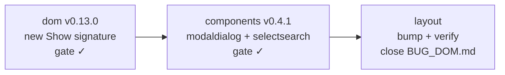

# MASTER PLAN — Show harness closure (`tinywasm/dom` / `tinywasm/components` / `tinywasm/layout`)

Multi-repo coordination hub. Replace `Show(cond, render func() *Element)` with
`Show(cond, content Component) *Element`. The old signature re-invoked the
render callback on every false→true transition; the second invocation
re-attached captured `*Element`s and panicked (`"element ... is already a child
of another element"` — see `layout/docs/BUG_DOM.md`). 2 of 2 consumers in the
ecosystem fell into the trap.

The new API builds the subtree ONCE and toggles `display:none` on a dom-owned
container. The illegal state (re-attaching a shared element) is unrepresentable
because there is no builder to re-run. Node identity, listeners and signal
bindings survive toggles — bindings keep patching while hidden.

> Dispatch: 2026-08-03 · **Status: 🚧 IN PROGRESS — S1 (dom v0.13.0) and S2 (components v0.4.1) published; S3 (layout) executed locally, pending demo re-verification.**

---

## Dependency graph

| Stage | Library | Plan | What | Status |
|---|---|---|---|---|
| **S1** | `tinywasm/dom` | [`dom/docs/PLAN.md`](https://github.com/tinywasm/dom/blob/main/docs/PLAN.md) | New `Show(cond, content)` — build once, toggle display; delete callback | ✅ Published v0.13.0 |
| **S2** | `tinywasm/components` | [`components/docs/PLAN_SHOW.md`](https://github.com/tinywasm/components/blob/main/docs/PLAN_SHOW.md) | Unwrap closures in modaldialog + selectsearch; replace Autofocus with explicit focus | ✅ Published v0.4.1 |
| **S3** | `tinywasm/layout` | [`layout/docs/PLAN.md`](https://github.com/tinywasm/layout/blob/main/docs/PLAN.md) | Bump dom→v0.13.0, components→v0.4.1; gotest green; close BUG_DOM.md | 🚧 Executed locally, demo check pending |

S1 is the gate — S2 cannot start until dom v0.13.0 is published. S2 is the
gate for S3 — gotest in S3 depends on components v0.5.0 being published with
the migrated Show calls.

---

## Stage-by-stage acceptance

### After S1 (dom v0.13.0 — published)

- `go get github.com/tinywasm/dom@v0.13.0` resolves.
- `go doc github.com/tinywasm/dom Show` → `func Show(cond *SignalBool, content Component) *Element`.
- The regression test `show_regression_wasm_test.go` (two toggle cycles, shared content, node identity, bindings live while hidden) is green in the dom repo.

### After S2 (components v0.4.1 — published)

- `go get github.com/tinywasm/components@v0.4.1` resolves.
- A `go build ./modaldialog ./selectsearch` against published dom compiles (no `func() *Element` remains in either package).
- `gotest` green in `tinywasm/components`.

### After S3 (layout — dependency bump + verified)

- `layout/go.mod` requires dom v0.13.0 and components v0.5.0; `gotest` green.
- `layout/docs/BUG_DOM.md` carries a visible resolution header.
- The bug scenario (delete → modal → cancel → delete again) no longer panics — verified in the `platformd` demo against published dependencies.

---

## Regression guard

The bug is pinned by a test in the owning library (`dom/show_regression_wasm_test.go`).
The test exercises exactly the consumer scenario that panicked in production:

1. A Show whose content would naturally be shared across toggles (any
   `*Element` built outside the old callback).
2. Two full open→close→open cycles.
3. Node identity preserved across toggles (no innerHTML re-render).
4. Signal bindings stay live while hidden and current on re-show.

This is the **consumer-shaped test** the Construction Harness requires
(`layout/docs/CONSTRUCTION_HARNESS.md` line 129: "An API is not published until
a consumer-shaped test, inside the library itself, proves it") — the only
consumer of the trap is the one who fell into it, duplicated verbatim.

---

## Harness lesson

The old signature `func() *Element` was a generic slot — callback taking nothing
and returning a generic element. No attacker would look at it and guess the
freshness requirement. Every consumer wrote the natural code and every consumer
panicked in production, but only on the SECOND toggle, so it survived every
first-use test.

Two harness principles were violated:

1. **"Things you have to remember"** — "the builder must return a fresh tree"
   is exactly that.
2. **"Fail at compile time, not at runtime"** — the panic on `attached == true`
   is a runtime invariant for a compile-level trap.

The fix removes the slot entirely. A `Component` value is attached once, by
construction — the `attached` invariant becomes an implementation detail of the
builder pattern, never a promise a consumer must keep.

---

## Related

- **`layout/docs/CONSTRUCTION_HARNESS.md`** — ecosystem principles; the bug is a
  worked example of an unclosed harness.
- **`layout/docs/BUG_DOM.md`** — the original panic report, now with resolution
  header.
- **`dom/show_regression_wasm_test.go`** — the permanent guard.
