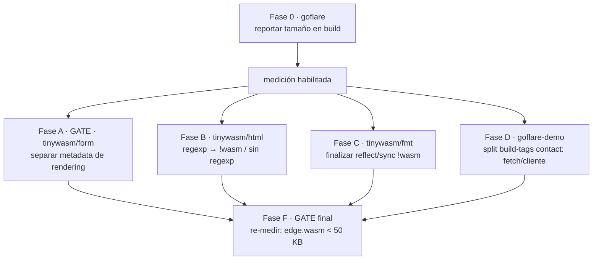

# MASTER PLAN — Optimización de tamaño WASM (ecosistema tinywasm)

Hub de coordinación multi-repo. Reducir el tamaño de los binarios WASM agnósticos
(workers de edge y frontend) eliminando **fugas de código de rendering/stdlib hacia código
que debería ser solo metadata/validación**. Objetivo de referencia: un worker de edge de
baja complejidad (rutear + insertar en D1) debe pesar **< 50 KB**, no ~342 KB.

> Dispatch: 2026-06-17 · **Estado: 🔄 EN PROGRESO**
> Coordina los `docs/PLAN.md` de cada librería afectada. Cada PLAN es autocontenido.

---

## 1. Principio rector (decisión del usuario)

> **Código agnóstico** (compila wasm **y** backend: schema, validación, metadata) **NO debe**
> importar:
> - `regexp` → cada input valida con su propia lógica Go.
> - rendering (`tinywasm/html`, `tinywasm/dom`) → es exclusivo de frontend/SSR.
> - stdlib pesado (`reflect`, `sync`) → solo backend.
>
> Todo eso va **solo en archivos `//go:build !wasm`** (backend/SSR) o en una capa de
> frontend separada. La misma librería se usa en todos lados; los build tags lo resuelven
> transparentemente.

> 📋 **Reglas permanentes por repo → `AGENTS.md`** (auto-cargado por Jules/codejob). Cada librería
> afectada tiene su `AGENTS.md` con las restricciones del ecosistema (no stdlib/map/reflect,
> agnóstico, `gotest`); los `docs/PLAN.md` **enlazan** a él en vez de duplicar el reglamento, e
> inlinean solo lo crítico de su tarea. Existen en `orm`, `json`, `jsvalue` (y `dom`, `app`,
> `goflare-demo`). `fmt` pendiente (se hará tras cerrar su fase en curso).

---

## 2. Línea base y metodología

Medido en `goflare-demo` (worker `edge` + frontend `client`):

| Binario | Actual | Objetivo |
|---|---|---|
| `edge.wasm` | ~342 KB | < 50 KB |
| `client.wasm` | ~350 KB | (reducir; menos crítico, usa dom/html legítimamente) |

**No es problema de flags:** goflare ya compila en modo producción
(`-opt=z -no-debug -panic=trap`, `CompilerMode="S"`, `UseProductionTinyGo()`). Es código real.

Metodología de medición (desglose por paquete):
```bash
# El -no-debug oculta el desglose; quitarlo SOLO para analizar:
tinygo build -target wasm -opt=z -panic=trap -size=full -o /tmp/x.wasm ./edge | sort -k1 -rn | head -30
# Tamaño real de producción:
tinygo build -target wasm -opt=z -no-debug -panic=trap -o /tmp/x.wasm ./edge && ls -la /tmp/x.wasm
# Quién importa qué (verificación de fugas):
GOOS=js GOARCH=wasm go list -deps ./edge | grep -E 'tinywasm/(html|dom)|^regexp$'
```

---

## 3. Causa raíz (cadena de fuga del edge)

```
edge → modules/contact → tinywasm/input → tinywasm/html (→ regexp ~35KB) + tinywasm/dom
```

`input.Input` embebe `dom.Component` (rendering) junto a `fmt.Widget` (metadata). El
`Schema()` generado por `ormc` referencia `input.Text()/Email()/…`; como el edge llama a
`Schema()` para `CreateTable` + validación, arrastra todo el stack de formularios + `regexp`.

Desglose `edge.wasm` (code, con debug):

| Paquete | code | Veredicto |
|---|---|---|
| `tinywasm/fmt` | ~31 KB | legítimo (ya tiene plan propio) |
| `regexp`+`regexp/syntax` | **~35 KB** | ❌ fuga (vía `html`) |
| `tinywasm/json` | ~13 KB | legítimo |
| `tinywasm/sqlt` | ~9 KB | legítimo |
| `tinywasm/tinywasm/input` | ~6 KB | ❌ fuga (widgets, no se renderiza) |
| `tinywasm/dom` | ~3 KB | ❌ fuga (rendering) |

---

## 4. Grafo de dependencias (gates vs paralelo)



- **Fase A es el gate principal** (causa raíz; cambia la superficie que consume `ormc`).
- **B, C, D corren en paralelo** entre sí y con A.
- **F es el gate de aceptación**: re-medir contra el objetivo.

---

## 5. Índice de planes por librería

| Fase | Repo | Plan | Foco | Impacto edge | Estado |
|---|---|---|---|---|---|
| A | `tinywasm/form` | [form/docs/PLAN_EXECUTED.md](../form/docs/PLAN_EXECUTED.md) | desacoplar `fmt.Widget` (metadata) de `dom.Component` (rendering) **por separación de paquete** | ~44 KB | ✅ DONE (v0.2.7, 2026-06-17) |
| B | `tinywasm/html` | — | `url_rewrite.go`: `//go:build !wasm` (SSR-only) | ~35 KB | ✅ DONE (v0.0.4, 2026-06-17) |
| C | `tinywasm/fmt` | [fmt/docs/PLAN_WASM_SIZE_OPTIMIZATION.md](../fmt/docs/PLAN_WASM_SIZE_OPTIMIZATION.md) | `reflect`/`sync` tras `!wasm` | ~31 KB ya optimizado (reflect fuera) | ✅ DONE (verificado 2026-06-17) |
| E | `tinywasm/fmt` | [fmt/docs/CHECK_PLAN.md](../fmt/docs/CHECK_PLAN.md) | extraer i18n a `fmt/lang` (**diccionario opt-in** vía hook); `Sprintf`/`Err`/`Html` dejan de arrastrar el diccionario | i18n fuera del camino de errores/validación | ✅ DONE (v0.24.1, 2026-06-17) |
| E.1 | `tinywasm/form` | [form/docs/PLAN_EXECUTED.md](../form/docs/PLAN_EXECUTED.md) | eliminar `words.go` (init auto) y `fmt.Translate` del core de form; texto crudo opt-in | `form` ya no arrastra diccionario | ✅ DONE (v0.2.9, 2026-06-17) |
| **H** (gate) | `tinywasm/fmt` | [fmt/docs/PLAN.md](../fmt/docs/PLAN.md) | contrato tipado `FieldWriter`/`Encodable`/`Decodable` (**0-alloc, map-free, sin `any`**) + encoder JSON de ref | causa raíz del `any`/`map`/`reflect` en los límites | ✅ DONE (v0.24.2, 2026-06-18) |
| **H1** | `tinywasm/orm` (`ormc`) | [orm/docs/PLAN.md](../orm/docs/PLAN.md) | `ormc` genera `EncodeFields`/`DecodeFields` tipados en los modelos | habilita serialización 0-alloc | ✅ DONE (v0.24.3-era, 2026-06-18) |
| **H2** | `tinywasm/jsvalue` | [jsvalue/docs/PLAN.md](../jsvalue/docs/PLAN.md) | migrar `ToJS`/`ToGo` al codec; **eliminar `reflect`+`map`** | **~72 KB** (reflect) + map | ✅ DONE (v0.0.13, 2026-06-18) |
| **H3** | `tinywasm/json` | [json/docs/PLAN.md](../json/docs/PLAN.md) | migrar `Encode`/`Decode` al codec → **0-alloc**; deja de usar `Pointers()` para serializar | 0-alloc; **una sola forma** (misma que jsvalue) | ✅ DONE (2026-06-19) |
| **H4** | `tinywasm/binary` | [binary/docs/PLAN.md](../binary/docs/PLAN.md) | migrar `Encode`/`Decode` al codec; **eliminar `reflect`+`sync.Once`** (singleton `instance`) | **~72 KB** (reflect) eliminados del binario wasm | ✅ DONE (2026-06-19) |
| D | `goflare-demo` | _por crear_ `modules/contact` | split build-tags: handler de edge vs submission de cliente (`fetch`) | **~0 (no es palanca)** | ⏸️ despriorizado (solo limpieza) |
| 0/F | `tinywasm/goflare` | _por crear_ | imprimir tamaño de `edge.wasm`/`client.wasm` al final de `goflare build` | (observabilidad) | 📋 por escribir |

> **Causa raíz arquitectónica (Fases H/H1/H2):** los límites convierten con tipo borrado (`any`),
> lo que fuerza `switch` infinito / `reflect` / `map` — los tres inflan el binario en TinyGo
> (`reflect` ~72 KB; `map` arrastra el runtime de hashmap). Cura: **contrato tipado** (visitor
> `FieldWriter`/`Encodable`) en `fmt` (agnóstico — `jsvalue` es wasm-only y no puede albergar la
> interfaz que implementan los modelos). 0-alloc Go-side, map-free, sin `any`.
>
> **Orden (gate + paralelo):** `H` (fmt, contrato) es GATE → luego `H1` (ormc), `H2` (jsvalue),
> `H3` (json) y `H4` (binary). `H1` es gate de uso real de `H2`/`H3`/`H4` (los modelos necesitan
> `EncodeFields`); pero los cuatro compilan/testean con tipos de test propios. Orden de **merge**:
> `H` → `H1` → `H2`,`H3`,`H4` (en paralelo entre sí).
> `H2` **reemplaza** la idea previa "G" (jsvalue→Fielder interino): jsvalue se toca una sola vez.
>
> **Una sola forma de serializar:** `json` (H3) y `jsvalue` (H2) usan AMBOS el contrato
> `Encodable`/`Decodable`. `fmt` (H) **no** trae un JSON propio (evita duplicar); el JSON
> canónico vive en `json`.
>
> **Decisiones de alcance:** `fmt.Fielder`/`Schema()`/`Pointers()` **se quedan**, pero SOLO para
> el rol **DB**: scan posicional SQL `row.Scan(Pointers()...)` en `orm` (la API de `database/sql`
> exige punteros posicionales; un visitor por-nombre no la reemplaza) + schema + validación. La
> **serialización** (json/jsvalue) deja de usar `Pointers()` y pasa al codec — son operaciones
> distintas, no "dos formas de serializar". **Aguas abajo de `H1`:** los repos con `*_orm.go`
> (`goflare-demo`, `user`, `devbrowser`, `devtui`, `orm/sqlmcp`) **regeneran** con el nuevo `ormc`.
>
> 📎 Referencia de la separación de responsabilidades (codec vs `Field`/`Fielder`):
> [fmt/docs/CODEC_AND_FIELDER.md](../fmt/docs/CODEC_AND_FIELDER.md).
>
> 📊 **Criterio de aceptación = comparativa antes/después, actualizando los benchmarks YA
> EXISTENTES** (no crear docs nuevos): **`json` (H3)** → `json/benchmarks/` (`build.sh` + clients
> stdlib/tinyjson + sección "Performance Results" del `benchmarks/README.md`): `ns/op`/`B/op`/
> `allocs/op` Antes|Después|`encoding/json`, con **0 allocs** después (es donde más se mueve
> información). **`jsvalue` (H2)** → `benchmark_test.go` + sección "Performance Results" del
> `README.md`: tamaño wasm Antes|Después (caída del bloque `reflect` ~72 KB) y allocs. Mismo
> espíritu que `fmt/benchmark` (standard-lib vs tinystring).

> **Medición gate F (2026-06-17):** `edge.wasm` **342 KB → 234 KB** (−108 KB). Fugas cerradas:
> `regexp`/`html`/`dom` fuera; `tinywasm/input` 6 KB → 0.3 KB. **Hallazgos nuevos:** (1) `fetch` NO
> aporta tamaño → Fase D despriorizada; (2) 🔴 `reflect` (~72 KB de tablas de tipos) entra vía
> `tinywasm/jsvalue` (`ToJS`/`ToGo`, sin consumidores en el ecosistema) → **Fase G**, la palanca
> grande que queda. **Objetivo <50 KB recalibrado:** irreal para este workload (fmt 30 + json 13
> + sqlt 9 + runtime/syscall 20 + goflare 14 = ~86 KB legítimos); meta realista **~120–150 KB**
> tras la Fase G.

> **Fase E — ejecutada (2026-06-17):** `fmt/lang` publicado (v0.24.1). El core `fmt` ya no
> arrastra el diccionario. `form/words.go` eliminado (v0.2.9): importar `form` ya no activa
> traducciones automáticas. Cadena de fuga del diccionario cerrada.

> **Fase B — ejecutada (2026-06-17):** `url_rewrite.go` movido a `//go:build !wasm` (v0.0.4).
> `regexp` fuera del path wasm. Pendiente: medir impacto real en `edge.wasm` (Fase F).

---

## 6. Decisiones abiertas (resolver en Q&A antes de despachar)

1. **Fase A — forma del split** (`tinywasm/form`): ✅ **RESUELTO → Opción A (separación de
   paquete).** Build tags descartados: edge y frontend son ambos `GOARCH=wasm`, ningún tag
   los separa. `input` queda como metadata agnóstica (`fmt.Widget`, sin dom/html); el render
   va a la capa frontend (`form`/`form/render`). Queda por cerrar solo el **mecanismo** de
   render (wrapper types vs funciones libres) — ver §6 del PLAN de `form`. La firma
   `input.X()` no debería cambiar (sigue devolviendo `fmt.Widget`), así que `ormc` no cambia.
2. **Fase B — `RewriteAssetURLs`**: ¿es SSR-only? Si sí → `//go:build !wasm` (preferido). Si
   debe ser agnóstico → escáner manual sin `regexp`.
3. **Fase F — objetivo**: confirmar <50 KB para el edge; definir umbral aceptable para
   `client.wasm` (que sí usa dom/html legítimamente).

---

## 7. Verificación global (gate F)

```bash
# 1. Sin fugas de rendering/regexp en el edge:
GOOS=js GOARCH=wasm go list -deps ./edge | grep -E 'tinywasm/(html|dom)|tinywasm/fetch|^regexp$'
#    → vacío.

# 2. Tamaño de producción bajo objetivo:
tinygo build -target wasm -opt=z -no-debug -panic=trap -o /tmp/edge.wasm ./edge
ls -la /tmp/edge.wasm        # → < 50 KB

# 3. Sin regexp agnóstico en ninguna lib del ecosistema:
for f in $(grep -rl '"regexp"' ~/Dev/Project/tinywasm/*/ --include=*.go | grep -v _test); do
  head -1 "$f" | grep -q 'go:build !wasm' || echo "AGNOSTIC regexp: $f"
done
#    → vacío.
```

---

## 8. Estado de cada repo

| Repo | Estado | Versión | Notas |
|------|--------|---------|-------|
| `tinywasm/fmt` | ✅ DONE | v0.24.1 | `reflect`/`sync` tras `!wasm`; i18n movido a `fmt/lang` opt-in |
| `tinywasm/form` | ✅ DONE | v0.2.9 | metadata/rendering desacoplados (v0.2.7); `words.go` + `fmt.Translate` eliminados (v0.2.9) |
| `tinywasm/html` | ✅ DONE | v0.0.4 | `url_rewrite.go` con `//go:build !wasm`; `regexp` fuera del path wasm |
| `tinywasm/goflare` | 📋 Pendiente | — | Falta plan para reportar tamaño en build |
| `goflare-demo` | 📋 Pendiente | — | `modules/contact` arrastra `fetch` al edge; falta split por build-tag |
