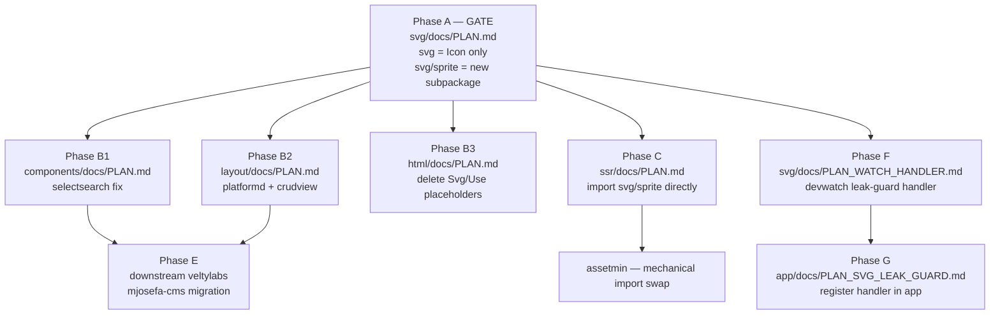

# MASTER PLAN — SVG icon harness (`tinywasm/svg` / `tinywasm/svg/sprite` split)

Multi-repo coordination hub. Restructure `tinywasm/svg` so that **only the
icon name (a typed string) is reachable from the WASM client**, while all
sprite construction (paths, viewBox, `<symbol>` markup, JSON serialization)
lives in a separate sub-package that only backend/SSR consumers import.

> Dispatch: 2026-07-11 · **Status: 🚧 IN PROGRESS (2026-07-12) — gate A published (`svg` v0.1.3); C + D + F closed. Remaining: B1 (components), B2 (layout), B3 (html), G (app), E (mjosefa-cms).**
> Coordinates the `docs/PLAN.md` of each affected library. Each PLAN is self-contained.
> Related: `SIZE_OPTIMIZATION_MASTER_PLAN.md` (same leak class: rendering/stdlib
> code escaping into WASM); `CONSTRUCTION_HARNESS.md` (ecosystem rationale).
>
> **v2 supersedes the build-tag design first drafted 2026-07-11.** Rejected
> reason: `tinywasm/svg` has two unconditional consumer classes — the WASM
> client AND the backend `tinywasm/ssr` extractor. A library cannot use
> `//go:build !wasm` internally to gate code the extractor legitimately needs
> at all times without forcing every file in the package to carry that tag,
> which is nonsensical for a library (its own doc/API would look tag-shaped
> instead of consumer-shaped). Build tags belong to the **consumer** (a
> component's `svg.go`), never to the library itself.

---

## 1. Problem — evidence (unchanged from v1)

1. `svg/README.md`'s documented pattern cannot compile: it tells consumers to
   define icons in a `//go:build !wasm` file and reference the same var from
   untagged `Render()` code.
2. Consumers resolved the contradiction two broken ways:
   - dropped the tag → `sprite.go` (imports stdlib `encoding/json`) and all
     path-string geometry compile into WASM
     (`components/selectsearch/svg.go`, `layout/platformd/svg.go`);
   - kept the tag → hand-built untyped `href="#id"` references
     (`layout/crudview/crudview.go:293`, `components/selectsearch/selectsearch.go:85`).
3. `svg.Svg()`/`svg.Use()` plus the `html.Svg()`/`html.Use()` placeholders
   (`html/builders.go:78-80`) allow a second, untyped construction path.

## 2. Decision (rationale) — sub-package split

Split by **package**, not by build tag:

| Package | Contains | Imported by |
|---|---|---|
| `tinywasm/svg` | `type Icon string` + `Render(classes ...string) *dom.Element` only. Imports only `tinywasm/dom`. | Everyone — WASM client and backend alike |
| `tinywasm/svg/sprite` | `Define(icon svg.Icon, viewBox string, body ...node) Symbol`, `Sprite`, `Path`, `Raw`, `NewSprite`, `SvgProvider`, JSON (de)serialization via `tinywasm/json`/`tinywasm/model` (never stdlib `encoding/json` — faster, and it's the codec this ecosystem's own tests actually exercise). Imports `tinywasm/svg` (one direction, no cycle) + `tinywasm/json` + `tinywasm/model`. | Only backend consumers: a component's `//go:build !wasm` `svg.go`, `tinywasm/ssr`'s extractor, `assetmin` |

Why this exact shape:

- **The dependency graph is the enforcement, not a tag.** `import
  "tinywasm/svg/sprite"` is a plain Go import statement — a WASM build that
  never imports it structurally cannot pull in `Sprite`, `Define`, or the
  `tinywasm/json`/`tinywasm/model` serialization machinery. No conditional
  compilation is required for `tinywasm/svg` itself; the same files compile
  identically for every target.
- **Serves both unconditional consumer classes correctly.** `tinywasm/ssr`'s
  extractor and `assetmin` are backend-only programs that need `sprite` at ALL
  times, unconditionally — not "when a build tag matches." Making them depend
  on a tagged build of `svg` would be backwards: they'd need to compile `svg`
  for `!wasm` specifically, which has nothing to do with their own target.
  Importing `svg/sprite` directly is simply correct, with no tag gymnastics.
- **`tinywasm/svg` stays trivially small and untagged.** Its only job is the
  typed reference + render call, usable in shared code without ceremony.
- **The consumer still tags their own file** (`component/svg.go` with
  `//go:build !wasm`), because *their* `IconSvg()` legitimately doesn't belong
  in a WASM build. That tag is the consumer's business, matching your rule:
  "the consumer places the tags, not the library."
- **One render path:** `Icon.Render()` is the only public way to emit
  `<svg><use>`. `svg.Svg()`/`svg.Use()` are deleted; `html.Svg()`/`html.Use()`
  placeholders are deleted (independent cleanup, see html plan).

### The one property lost vs. the (rejected) tag-inside-svg design

v1 made forgetting the consumer's `!wasm` tag a **compile error** (`svg.Define`
wouldn't exist for wasm). With `sprite` as an importable-anywhere package, an
untagged `svg.go` that imports `sprite` compiles fine under TinyGo too — it
would **silently leak** sprite geometry plus the `tinywasm/json`/`tinywasm/model`
serialization code into the WASM binary instead of failing loudly.

**Mitigation:** an explicit dependency-graph assertion, run in CI/verification
of every front-facing consumer:

```bash
GOOS=js GOARCH=wasm go list -deps ./... | grep tinywasm/svg/sprite   # must be empty
```

This is stated as a **mandatory verification step** in every consumer plan
below (components, layout) and recorded as a permanent rule in each repo's
AGENTS.md. It is a graph assertion, not a compiler error — weaker than v1 in
mechanism, but correct in scope (the library cannot dictate consumer tags) and
sufficient in practice (`gotest`/CI catches it before publish).

### Alternatives considered and rejected

1. **v1: tags inside `tinywasm/svg`** — rejected per the header above: breaks
   the extractor's unconditional need for `sprite` and puts consumer-shaped
   concerns (build targets) inside the library's own file layout.
2. **AGENTS.md rule only, no package split** — nothing fails when violated;
   today's leaks are the proof.
3. **Code generation (emit id constants from svg.go)** — extra toolchain step,
   drift between generated and source, more machinery than a typed sub-package.

## 3. Dependency graph



## 4. Phases

| Phase | Repo / plan | Blocks | Execution | Status |
|---|---|---|---|---|
| **A (gate)** | `svg/docs/PLAN.md` — create `svg/sprite` sub-package, shrink `svg` to `Icon` only, delete `Svg()`/`Use()`, README fix | B1, B2, B3, C, F | codejob | ☑ **v0.1.3**. `svg` = `Icon` + `ID()` + `Render()`. `SvgProvider` was deleted, not moved to `sprite` (consumers declare their own local interface — `assetmin` already did). `Define` returns `Definition` (plan said `Symbol`). |
| B1 | `components/docs/PLAN.md` — selectsearch: typed const, import `svg/sprite` in tagged `svg.go`, kill raw `"#ss-arrow-down"`, add leak-check (runs **before** the queued `CHECK_PLAN.md`) | E | codejob | ☐ |
| B2 | `layout/docs/PLAN.md` — platformd `svg.go` → `svg/sprite`, `IconID() string` → `Icon() svg.Icon`, crudview raw refs, leak-check | E | codejob | ☐ |
| B3 | `html/docs/PLAN.md` — delete `Svg()`/`Use()` placeholders (independent, unaffected by v1→v2 change) | — | LOCAL possible | ☐ |
| C | `ssr/docs/PLAN.md` — extractor imports `svg/sprite` directly (mechanical import swap, no tag contract needed anymore) | G2 | LOCAL possible | ☑ Done, plan deleted. Feature-detection regexes match the METHOD NAME only, so the generated `main.go` keeps `Icons any` — invariant now documented in `invoke.go`. |
| **F** | `svg/docs/PLAN_WATCH_HANDLER.md` — new `svg/watch` package implementing `devwatch.FilesEventHandlers`: on every `svg.go` save, parses imports (mtime-cached, same pattern as `ssr/scanner.go`) and fails loudly if the file imports `svg/sprite` without a leading `//go:build !wasm`. Automates the manual `go list -deps \| grep` check at edit-time instead of pre-publish-time. Queued in `svg/docs/PLAN.md` (does not block Phase A). | G | codejob | ☑ Shipped inside Phase A's commit as `svg/watch.LeakGuard` (`New()`, no setters). |
| **G** | `app/docs/PLAN_SVG_LEAK_GUARD.md` — wire `svg/watch`'s handler into `app/section-build.go` the same way `ormc` is wired (`h.SvgLeakGuard = watch.New()`; add to `FilesEventHandlers` slice; `h.Tui.AddHandler(...)`). Queued in `app/docs/PLAN.md` (does not block the urgent Kind-refactor unblock plan already there). | — | codejob | ☐ |
| D (optional) | `assetmin` — import swap **plus two real fixes it exposed**: (1) `InjectSpriteIcon(id, svg)` silently defaulted to `viewBox="0 0 16 16"`, clipping every 24×24 icon (this was the reported `help`/`catalog` bug) — `viewBox` is now a required argument; (2) raw `.svg` files were injected whole, nesting an `<svg>` inside the `<symbol>` — now `sprite.AddFile` parses the root element. Parsing SVG markup lives in `svg/sprite`, never in assetmin. | — | LOCAL | ☑ **v0.4.4** |
| E | `veltylabs/mjosefa-cms` (`config/`, `modules/service_catalog/svg.go`) — migrate to new API. Outside this monorepo; plan written on arrival. | — | LOCAL | ☐ |

Phases B1/B2/B3/C are parallel once A publishes. F depends only on A (needs
`svg/sprite` to exist as an import path to detect); G depends on F.

## 4b. Editor-time automation (why F/G exist)

The README's `GOOS=js GOARCH=wasm go list -deps ./... | grep tinywasm/svg/sprite`
check only catches a leak right before publish — nobody runs it by habit.
`tinywasm/app`'s hot-reload already has a generic extension point for this:
`devwatch.FilesEventHandlers` (`devwatch/devwatch.go`), the same interface
`tinywasm/ormc` implements to regenerate `*_orm.go` on every `models.go` save
(`ormc/watch.go`). Phase F gives `svg` a handler of its own, scoped to
`svg.go` files only (mirroring how `ormc` scopes to `model.go`/`models.go`
inside `NewFileEvent`, not via `SupportedExtensions`), reusing the mtime-cache
parsing pattern already proven in `ssr/scanner.go` rather than inventing a
shared parse bus (evaluated and rejected — see decision below).

**Decision: no centralized AST/parse bus in `devwatch` or `app`.** Each
`FilesEventHandlers` implementation (`ormc`, `ssr/scanner`, `depfind`,
`image/min`, and now `svg/watch`) parses independently today; `devwatch`
dispatches only `(fileName, extension, filePath, event string)`, no shared
AST. A shared bus would be new cross-repo infrastructure to fix a minor,
per-file, `ImportsOnly`-scoped parse cost — not worth it for this feature.
`svg/watch` copies the cheap, already-proven mtime-cache pattern instead.

**Decision: block, do not auto-fix.** The handler reports an error (visible in
the TUI/hot-reload log) when a `svg.go` file imports `svg/sprite` without the
`!wasm` tag; it does NOT insert the tag automatically. Auto-fixing could mask
a case where the import in shared code was a genuine design mistake, not a
forgotten tag — "fail loud, never silent" per the construction harness.

## 5. Cross-phase verification (leak check)

Run in each front-facing repo after its phase:

```bash
# 1. wasm build must pass:
GOOS=js GOARCH=wasm go build ./...
# 2. sprite package must be structurally unreachable from wasm — THE key check
#    replacing v1's "compile error if tag forgotten":
GOOS=js GOARCH=wasm go list -deps ./... | grep tinywasm/svg/sprite   # must be empty
# 3. no raw sprite references left:
grep -rn 'href", "#' --include='*.go' . | grep -v '_test'             # must be empty
grep -rn 'svg.Svg()\|svg.Use()' --include='*.go' .                    # must be empty
```

Size regression check (see `SIZE_OPTIMIZATION_MASTER_PLAN.md` §2 for the full
methodology): compare `client.wasm` before/after phase B2 — the three platformd
path strings alone must disappear from the binary.

## 6. Rules

- An agent in one phase does NOT touch another repo's contracts: on conflict,
  STOP and report.
- On closing a plan: mark it here, record permanent decisions in the repo's
  ARCHITECTURE/DESIGN + AGENTS.md, delete the dispatched `docs/PLAN.md`.
- Every consumer AGENTS.md MUST record the leak-check command from §5 as a
  permanent, mandatory pre-publish step — this is the substitute for the
  compile-time guarantee the tag-inside-library design would have given.
