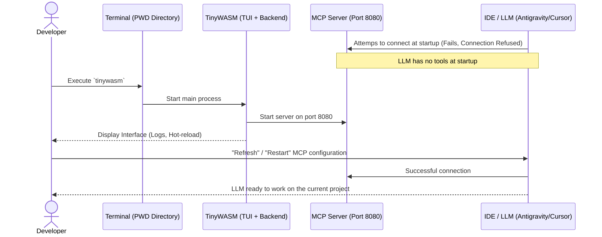

```mermaid
sequenceDiagram
    actor Dev as Developer
    participant Terminal as Terminal (PWD Directory)
    participant TUI as TinyWASM (TUI + Backend)
    participant MCP as MCP Server (Port 8080)
    participant IDE as IDE / LLM (Antigravity/Cursor)

    IDE->>MCP: Attemps to connect at startup (Fails, Connection Refused)
    Note over IDE, MCP: LLM has no tools at startup
    
    Dev->>Terminal: Execute `tinywasm`
    Terminal->>TUI: Start main process
    TUI->>MCP: Start server on port 8080
    TUI-->>Dev: Display Interface (Logs, Hot-reload)
    
    Dev->>IDE: "Refresh" / "Restart" MCP configuration
    IDE->>MCP: Successful connection
    IDE-->>Dev: LLM ready to work on the current project
```
