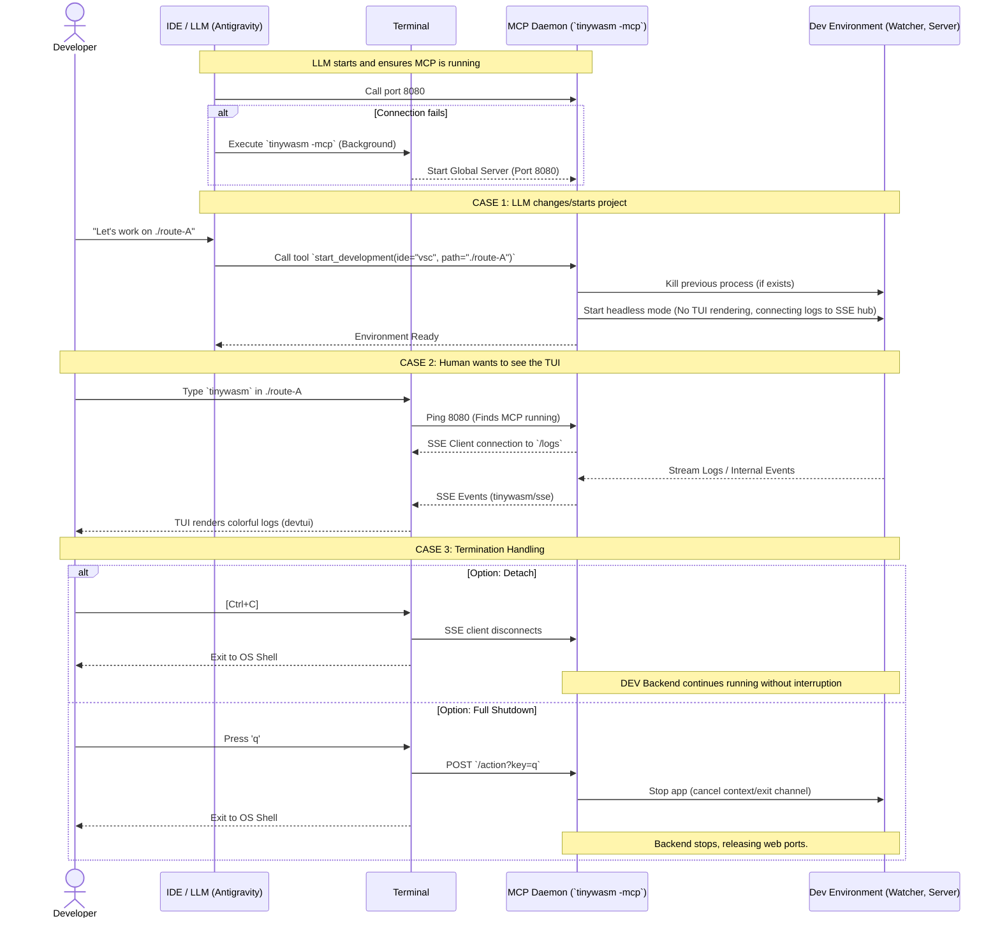

```mermaid
sequenceDiagram
    actor Dev as Developer
    participant IDE as IDE / LLM (Antigravity)
    participant Term as Terminal
    participant MCP as MCP Daemon (`tinywasm -mcp`)
    participant Backend as Dev Environment (Watcher, Server)
    
    Note over IDE, MCP: LLM starts and ensures MCP is running
    IDE->>MCP: Call port 8080
    alt Connection fails
        IDE->>Term: Execute `tinywasm -mcp` (Background)
        Term-->>MCP: Start Global Server (Port 8080)
    end
    
    Note over IDE, Backend: CASE 1: LLM changes/starts project
    Dev->>IDE: "Let's work on ./route-A"
    IDE->>MCP: Call tool `start_development(ide="vsc", path="./route-A")`
    MCP->>Backend: Kill previous process (if exists)
    MCP->>Backend: Start headless mode (No TUI rendering, connecting logs to SSE hub)
    MCP-->>IDE: Environment Ready
    
    Note over Dev, Backend: CASE 2: Human wants to see the TUI
    Dev->>Term: Type `tinywasm` in ./route-A
    Term->>MCP: Ping 8080 (Finds MCP running)
    MCP-->>Term: SSE Client connection to `/logs`
    Backend-->>MCP: Stream Logs / Internal Events
    MCP-->>Term: SSE Events (tinywasm/sse)
    Term-->>Dev: TUI renders colorful logs (devtui)
    
    Note over Dev, Backend: CASE 3: Termination Handling
    alt Option: Detach
        Dev->>Term: [Ctrl+C]
        Term->>MCP: SSE client disconnects
        Term-->>Dev: Exit to OS Shell
        Note over MCP, Backend: DEV Backend continues running without interruption
    else Option: Full Shutdown
        Dev->>Term: Press 'q'
        Term->>MCP: POST `/action?key=q`
        MCP->>Backend: Stop app (cancel context/exit channel)
        Term-->>Dev: Exit to OS Shell
        Note over MCP, Backend: Backend stops, releasing web ports.
    end
```
